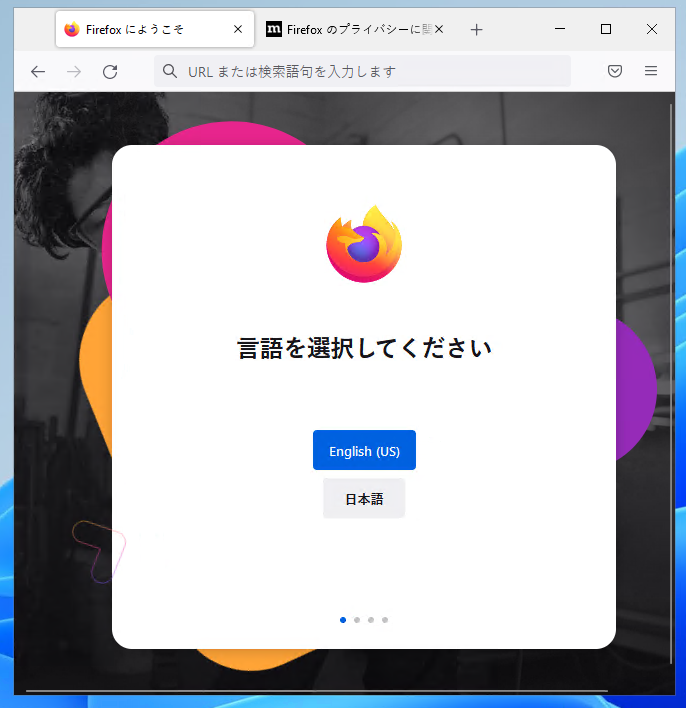
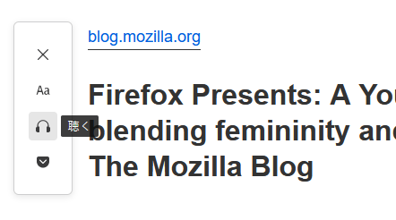

# Firefox ESR102のリリーススケジュール

[Mozillaのリリースカレンダー](https://wiki.mozilla.org/RapidRelease/Calendar)では、Firefox ESR102のリリース予定は以下の通り記載されています。

|リリース日     |通常版リリースバージョン|ESR版リリースバージョン|備考               |
|---------------|------------------------|-----------------------|-------------------|
| 2022年5月31日 | Firefox 101            | 91.10                 |ESR102ベータ版     |
| 2022年6月28日 | Firefox 102            | 91.11/102.0           |ESR102正式版       |
| 2022年7月26日 | Firefox 103            | 91.12/102.1           |                   |
| 2022年8月23日 | Firefox 104            | 91.13/102.2           |                   |
| 2022年9月20日 | Firefox 105            | 102.3                 |ESR91のサポート終了|

Firefox ESR91のサポートは、2022年9月20日で終了します（以後はセキュリティ更新が提供されません）。

* 日付は太平洋標準時 (UTC-0800) 基準のため、日本時間では表記の日付の約1日後がリリース日となります。
* なお、リリーススケジュールは予告なく変更される可能性があります。

# 法人利用への影響が予想される代表的な変更点

* 自動更新がバックグラウンドで行われるようになりました。
* Windowsのファイルの関連付けにおいて、FirefoxがPDFビューワーの一つとして登録されるようになりました。
* Windows用インストーラがSHA-256で署名されるようになりました。Windows 7および互換環境へのインストールには、KB4474419の適用が必要となります。
* 安全でない接続を介して表示されているWebサイトからのファイルのダウンロードが、初期状態でブロックされるようになりました。
* TLSでの暗号アルゴリズムとして、3DESが無効化されました（古いバージョンのTLSを明示的に有効化した場合を除く）。
* リファラーの送信ポリシー（`Referrer-Policy`ヘッダ）の値の一部が無視されるようになりました。リファラーに依存して動作するシステムは影響を受ける可能性があります。
* Firefoxのメジャーバージョン番号が3桁になりました。2桁未満の番号であることを前提に作られたWebページにおいて、バージョン判別に失敗する可能性があります。

\newpage

# カテゴリごとの変更点

## 外観、メニュー構成の変更

Firefox ESR91からESR102の間で、ブラウザーウィンドウの外観上の目立った変化はありません。

* 初期状態で、ブラウザーウィンドウやFirefoxの終了時に確認を求めないようになりました。[詳細](https://support.mozilla.org/kb/how-configure-close-tab-warnings-firefox)（Firefox 94）  
  
  - この挙動は、「設定」→「一般」→「タブグループ」→「同時に複数のタブを閉じる前に確認する」をONにする（Tab-1-1）ことで従来の動作に戻せます。
* Windows 11の[スナップレイアウトメニュー](https://docs.microsoft.com/ja-jp/windows/apps/desktop/modernize/apply-snap-layout-menu)に対応しました。（Firefox 94）  
  
  <!-- - この挙動は設定で無効化できません。 -->
* LinuxとWindows 11において、スクロール中以外はスクロールバーが非表示になるようになりました。（Firefox 97、Firefox 100）  
  
  - Windowsでは、この挙動はシステムの設定（システムの設定→アクセシビリティ→視覚効果→常にスクロールバーを表示する）に従います。
    Linuxでは、この挙動はFirefoxの設定（設定→一般→ナビゲーション→スクロールバーを常に表示する）で制御可能です。
* リンクのフォーカスリングを点線状の表示から変更し、フォームの入力欄と同様の実線状の表示に統一しました。（Firefox 100）  
  
  <!-- - この機能は設定で無効化できません。従来の表示に戻すには、userContent.cssでの `:focus-visible { outline: 1px dotted !important; }` のような指定が必要です。 -->

<!-- 以下、単純な修正や既に影響のない変更のため非表示
* [ベンガル語の文字のレンダリングの不具合](https://bugzilla.mozilla.org/show_bug.cgi?id=1763368)が修正されました。（Firefox 99）
* 期間限定のカラフルなテーマ（Colorways）が追加されました。（Firefox 94）この機能はその後無効化されました。（Firefox 97）
-->

## ファイルのダウンロード

* 安全性向上のため、HTTPSで閲覧しているWebページからの、HTTPSでないURLからのファイルのダウンロードをブロックするようになりました。[詳細1](https://blog.mozilla.org/security/2021/10/05/firefox-93-protects-against-insecure-downloads/)、[詳細2](https://support.mozilla.org/ja/kb/where-find-and-manage-downloaded-files-firefox)（Firefox 93）
  - この挙動は、MCDまたはポリシー設定の `Preferences` で `dom.block_download_insecure` を `false` に設定する事で無効化できます。
* 安全性向上のため、サンドボックス化されたインラインフレーム内からの要求で発生するダウンロード操作は、インラインフレームに[`allow-downloads`属性](https://developer.mozilla.org/en-US/docs/Web/HTML/Element/iframe#attr-sandbox)が設定されていない限り、ブロックするようになりました。（Firefox 93）
  - この挙動は、MCDまたはポリシー設定の `Preferences` で `dom.block_download_insecure` を `false` に設定する事で無効化できます。
* ダウンロードの操作フローが最適化されました。毎回確認が表示される代わりに、ダウンロードフォルダへのファイルの保存が自動的に開始されます。[詳細](https://support.mozilla.org/kb/manage-downloads-preferences-using-downloads-menu)（Firefox 98）
  - ただし、macOS以外の環境では、ダウンロードしてすぐにヘルパーアプリケーションで開くよう指示されたファイルは、ダウンロードフォルダーではなく常にシステムのテンポラリフォルダー内に保存されます。（Firefox 102）
* ファイルの種類ごとの設定について、「毎回確認する」が選択されていた場合、[Firefox 98以降に更新した時点で設定が初期状態（Firefoxで表示できる物はFirefoxで表示し、それ以外はファイルを保存）にリセットされます](https://bugzilla.mozilla.org/show_bug.cgi?id=1736924)。（Firefox 98）
  - この挙動は、MCDまたはポリシー設定の `Preferences` で `browser.download.improvements_to_download_panel` を `false` に設定する事で無効化できます。
* 未知の種類のファイルのダウンロード時の既定の挙動として、「保存する（初期設定）」か「アプリケーションで開くかどうかを訊ねる」かを設定できるようになりました。（Firefox 101）
  - この挙動は、MCDまたはポリシー設定の `Preferences` で `browser.download.always_ask_before_handling_new_types` を用いて制御できます。
<!-- 以下、単純な修正のため非表示
* ダウンロードパネルのプログレスバーにFirefoxのテーマの配色を反映するようになりました。（Firefox 93）
* ファイルの種類ごとに既定のアプリケーションを設定できなくなっていた問題が修正されました。（Firefox 98）
* [ダウンロードパネル内でのドラッグ＆ドロップの不具合](https://bugzilla.mozilla.org/show_bug.cgi?id=1762723)が修正されました。（Firefox 99）
-->

## インストール・自動更新

* Firefoxが終了している状態でも、バックグラウンドエージェントによってFirefoxの自動更新が行われるようになりました。（Firefox 94）
  - この挙動は、ポリシー設定の `BackgroundAppUpdate`（または設定シートのUpdate-1-4）で無効化できます。<!--
* Windows 10とWindows 11において、Microsoft Storeから[Firefoxをダウンロード](https://support.mozilla.org/kb/download-firefox-windows-microsoft-store)できるようになりました。（Firefox 95）
  - ESR91は未提供。ESR102が提供されるようになるかは不明。
-->
* インストール後の初回起動時に、OSの表示言語とFirefoxの表示言語が一致していなかった場合に、ユーザーに対して言語の選択を促すようになりました。（Firefox 100）  
  
  - この挙動を単独で無効化する設定はありません。（初回起動時の案内画面の表示自体をStartup-12-3で抑制する事はできます。）
* Windows用インストーラがSHA-256で署名されるようになりました。[Windows 7でのインストールにはKB4474419の導入が必要となります](https://support.microsoft.com/en-us/help/4474419/sha-2-code-signing-support-update)。（Firefox 100）

## アドレスバー検索

* ロシア国内の検索サービスであるYandexおよびMail.ruが、組み込みの検索プロバイダーから削除されました。（Firefox 98）

## PDF.js（PDFビューワー）

* 政府機関や銀行で使われるXFAベースのフォームに対応しました。（Firefox 93）
* ウムラウトなどの発音記号の有無を無視してページ内検索できるようになりました。（Firefox 99）
* 新規に導入された場合に、Firefoxを既定のPDFビューワーとして設定できるようになりました。（Firefox 100）
  - この動作は無効化できないため、Firefoxを既定のPDFビューワーに列挙しないようにするためには、`FirefoxPDF`で始まる名前のファイルの種類の関連付け情報（`HKEY_LOCAL_MACHINE\SOFTWARE\Classes\FirefoxPDF-*` など）を削除する必要があります。

<!-- 以下、単純な修正や性能向上に類するため非表示
* ハイコントラストモードでのPDFの可読性が向上しました。（Firefox 102）
-->

## 印刷

* 印刷時に奇数ページまたは偶数ページのみを印刷できるようになりました。（Firefox 96）  
  

## パスワードマネージャ、Cookie、プライバシー情報の保護

* トラッキング保護の副作用でWebサイトを正常に閲覧できなくなる問題を軽減する「SmartBlock」の機能強化により、厳密なトラッキング保護の有効時、およびプライベートブラウジングモードにおいて、Webページ閲覧の互換性が向上しました（SmartBlock 3.0）。[詳細](https://blog.mozilla.org/security/2021/10/05/firefox-93-features-an-improved-smartblock-and-new-referrer-tracking-protections/)（Firefox 93）
  - Google Analytics、Optimizely、Criteo、Amazon TAMなどのトラッキング機構を使用しているWebページとの互換性が改善されています。
* トラッキング保護のため、厳密なトラッキング保護の有効時、およびプライベートブラウジングモードにおいて、リファラーは最小限の情報のみ送信されるようになりました。[詳細](https://blog.mozilla.org/security/2021/10/05/firefox-93-features-an-improved-smartblock-and-new-referrer-tracking-protections/)（Firefox 93）
  - 従来は、Webサイトが`Referrer-Policy`ヘッダで明示的に許可している場合、Firefoxはクロスオリジンでの詳細なリファラー情報（URLのパス部分やクエリ文字列など）の取得をWebサイトに許可していました。この変更により、明示的な許可を与えられている場合でも、Webサイトはそれらの詳細なリファラー情報をクロスオリジンでは取得できなくなりました。
  - この挙動は、MCDまたはポリシー設定の `Preferences` で `network.http.referer.disallowCrossSiteRelaxingDefault.pbmode` および `network.http.referer.disallowCrossSiteRelaxingDefault.pbmode.top_navigation` を `false` に設定する事で無効化できます。
* トラッキング保護のため、通常モードでも、インラインフレームや画像・スクリプトなどのサブリソースの読み込みリクエストについては、リファラーは最小限の情報のみ送信されるようになりました（Firefox 100）
  - この挙動は、MCDまたはポリシー設定の `Preferences` で `network.http.referer.disallowCrossSiteRelaxingDefault` を `false` に設定する事で無効化できます。

<!-- 以下、単純な修正や性能向上に類するため非表示
* [検索機能のテレメトリにおいて想定外のデータが送信されていた問題](https://bugzilla.mozilla.org/show_bug.cgi?id=1752317)が修正されました。（Firefox 96）
-->

## 動画・音声

* ロイヤリティフリーの動画形式の一つであるAV1に基づく新しい画像形式のAVIFに対応しました。（Firefox 93）
* 対応GPUであるIntel第11世代以降およびAMD RDNA 2（Navi 21、Gecorce 30を除く）を使用しているWindows環境において、AV1形式の動画のハードウェアアクセラレーションが有効化されました。この改善を反映するためには、Microsoftストアからの[AV1 Video Extension](https://www.microsoft.com/en-us/p/av1-video-extension/9mvzqvxjbq9v?activetab=pivot:overviewtab)のインストールが必要です。（Firefox 100）
* [ピクチャーインピクチャー](https://support.mozilla.org/kb/about-picture-picture-firefox)の使い勝手が改善されました。
  - 機能を有効化するためのボタンの表示位置を、ボタン上のコンテキストメニューの「ピクチャーインピクチャーの切り替えボタンを左（右）側に移動」で、動画の反対側に表示できるようになりました。（Firefox 95）  
    
  - YouTube、Amazon Prime Video、Netflixのほか、Coursera.org、Canadian Broadcasting CorporationなどのようなWebVTT形式を使用したWebサービスの動画再生時に、ピクチャーインピクチャー表示での字幕・キャプションの表示に対応しました。（Firefox 100）  
    
<!-- 以下、単純な修正や性能向上に類するため非表示
* 多くの環境において、`video`要素での映像再生の色再現性が向上しました。（Firefox 92）
* 動画再生時に同期信号が不意に失われる事があった問題が修正されました。（Firefox 96）
* ノイズ軽減、音量の自動調整、エコー軽減などの効果が改善されました。（Firefox 96）
* WebRTCにおいて画面共有の解像度の自動ダウングレードの不具合が修正されました。（Firefox 96）
* いくつかのWebサイトにおいて、回線状況に合わせた動画品質の自動調整の不具合が修正されました。（Firefox 96）
* [新しめのIntelのドライバーでハードウェアによる動画のデコードが機能しなかった問題](https://bugzilla.mozilla.org/show_bug.cgi?id=1762125)が解消されました。（Firefox 99）
* Sinkオブジェクトにストリーミング用のデータを書き出すためのインターフェースを提供する、WriableStream APIが追加されました。（Firefox 100）
* ReadableStreamにpipeToメソッドが追加され、ReadableStreamをWritableStreamに接続できるようになりました（例：WritableStreamのSinkオブジェクトのfetchメソッドを使ったデータの読み取りなど）。（Firefox 100）
* [Netflixにおいてピクチャーインピクチャーでの字幕表示の不具合](https://bugzilla.mozilla.org/show_bug.cgi?id=1768818)が解消されました。（Firefox 100）
* Intel GPUを使用しているWindows環境において、動画のオーバーレイ表示が有効化されました。動画の再生時に電力使用量が削減されます。（Firefox 100）
* ビデオ通話中に、同時に複数のマイクデバイスを使えるようになりました。これにより、（サービス提供者が許可していれば）好きな時にマイクを切り替えられます。（Firefox 101）
  - [ピクチャーインピクチャーのウィンドウでいくつかのコマンドが機能しない不具合](https://bugzilla.mozilla.org/show_bug.cgi?id=1768201)が解消されました。（Firefox 100）
-->

## セキュリティ

* 証明書エラー発生時に表示されるエラーページのデザインが変更されました。（Firefox 92）  
  
* DNSの[HTTPS RR（Resource Record）](https://developer.mozilla.org/en-US/docs/Glossary/https_rr)の情報に基づき、HTTPでアクセスしたサイトについて、接続を自動的にHTTPSに切り替えられるようになりました。（Firefox 92）
  - HTTPS RRは、DNSの応答の中に、HTTPSでの通信に必要な各種の情報を事前に含めるための仕様です。この情報を活用することで、ブラウザーはセキュリティおよび応答性を向上できます。
  - この挙動は、MCDまたはポリシー設定の `Preferences` で `network.dns.upgrade_with_https_rr` を `false` に設定する事で無効化できます。
* TLSでの暗号アルゴリズムとして、3DESが無効化されました。3DESは古いバージョンのTLSが有効化された場合にのみ有効化されます。[詳細](https://blog.mozilla.org/security/2021/10/05/securing-connections-disabling-3des-in-firefox-93)（Firefox 93）
  - この挙動は、MCDまたはポリシー設定の `Preferences` で `security.ssl3.deprecated.rsa_des_ede3_sha` を `false` に設定する事で無効化できます。
* Spectreなどのサイドチャンネル攻撃からユーザーを保護する[サイト分離モード](https://hacks.mozilla.org/2021/05/introducing-firefox-new-site-isolation-security-architecture/)が導入され、全ユーザーの環境で有効となりました。（Firefox 94、Firefox 95）
  - ブラウザーが使用するプロセスとメモリー空間をWebサイトごとに分離し、サイドチャンネル攻撃をより困難にする、という性質の機能です。
  - 副作用として、メモリー消費量の増大が懸念されます。
  - この挙動は、MCD で `fission.autostart` を `false` に設定する事で無効化できます。
* [RLBox](https://hacks.mozilla.org/2021/12/webassembly-and-back-again-fine-grained-sandboxing-in-firefox-95/)により、サードパーティ製ライブラリの未知の脆弱性の影響を受けにくくなりました。Firefox 94）
  - サードパーティー製ライブラリをFirefoxに組み込む際に、可能な限り無害化する加工を施してから組み込む、という性質の機能です。
  - この変更はビルドの最適化と同様に、Firefoxのビルド時に反映される物のため、実行時のON/OFF制御はできません。
* [Windowsにおいて、コンテンツ用のプロセスのセキュリティサンドボックスがWin32 APIにアクセスを防ぐようになりました](https://bugzilla.mozilla.org/show_bug.cgi?id=1767999)。（Firefox 100）
  - この挙動は、MCDで `security.sandbox.content.win32k-disable` を `false` に設定する事で無効化できます。

## 使い勝手の向上

* リーダービューモードにおいて、キーボードショートカット「N」で読み上げをのON/OFFを切り替えられるようになりました。（Fierfox 99）  
  
  <!-- - この挙動は設定で無効化できません。 -->
* [スペルチェッカー](https://support.mozilla.org/en-US/kb/how-do-i-use-firefox-spell-checker)で複数言語をチェックできるようになりました。テキスト入力欄のコンテキストメニューから追加の言語を有効にできます。（Firefox 100）  
  
  <!-- - この機能は設定で無効化できません。 -->

## 集中管理

<!--
* Firefoxの配布時の挙動をより細かく制御できるMSIXパッケージが提供されるようになりました。（Firefox 94）
  - Microsoftストアからインストールする際に使われる形式のパッケージ。
  - ESR91および102ベータ段階ではESR版は未提供。
  - インストール先は「C:\Program Files\WindowsApps\Mozilla.MozillaFirefox_101.0.1.0_x64__gmpnhwe7bv608\VFS\ProgramFiles\MozillaFirefox Package Root」のようになる。
  - distribution配下にdistribution.iniがあり、mozilla-MSIXというディストリビューションの扱いになる。
  - 全言語のロケールが同梱されており、動作時に最適な物が自動選択される模様。
-->
* ポリシー設定で制御可能な設定項目の範囲が拡大しました。
  - Cookieの既定の動作を[`Cookies.Behavior`および`Cookies.BehaviorPrivateBrowsing`](https://github.com/mozilla/policy-templates#cookies)で細かく制御できるようになりました。（Firefox 95）
  - [`DisabledCiphers`](https://github.com/mozilla/policy-templates#disabledciphers)に指定可能な値に以下が加わりました。（Firefox 97）
    * `TLS_ECDHE_ECDSA_WITH_AES_128_CBC_SHA`
    * `TLS_ECDHE_ECDSA_WITH_AES_256_CBC_SHA`
    * `TLS_ECDHE_ECDSA_WITH_AES_256_GCM_SHA38`
    * `TLS_ECDHE_ECDSA_WITH_CHACHA20_POLY1305_SHA256`
    * `TLS_ECDHE_RSA_WITH_AES_256_GCM_SHA384`
    * `TLS_ECDHE_RSA_WITH_CHACHA20_POLY1305_SHA256`
  - Mozillaの契約パートナーが提供する項目のホーム画面への表示可否を[`FirefoxHome.SponsoredTopSites`と`FirefoxHome.SponsoredPocket`](https://github.com/mozilla/policy-templates#firefoxhome)で制御できるようになりました。（Firefox 95）
  - [`LegacySameSiteCookieBehaviorEnabled`](https://github.com/mozilla/policy-templates#legacysamesitecookiebehaviorenabled)で、Same Site Cookieの挙動をより安全にしつつ、特定のサイトに対してのみSame Site Cookieの挙動を従来の挙動に戻せるようになりました。対象となるWebサイト（ホスト名）を[`LegacySameSiteCookieBehaviorEnabledForDomainList`](https://github.com/mozilla/policy-templates#legacysamesitecookiebehaviorenabledfordomainlist)で列挙する必要があります。（Firefox 96）
  - [`PasswordManagerExceptions`](https://github.com/mozilla/policy-templates#passwordmanagerexceptions)でオリジンを列挙したWebサイトにおいて、パスワードの保存を明示的に禁止できるようになりました。（Firefox 101）
  - `StartDownloadsInTempDirectory`で、ダウンロードしてすぐにヘルパーアプリケーションで開くよう指示されたファイルを、ダウンロードフォルダーではなくテンポラリフォルダー内に保存させる動作を制御できるようになりました。（Firefox 102）

## レガシーな仕様への対応終了、機能の廃止

* 現在のWeb標準仕様に含まれない[`KeyboardEvent.initKeyEvent()`](https://developer.mozilla.org/en-US/docs/Web/API/KeyboardEvent/initKeyEvent)が初期状態で無効化されました。（Firefox 93）
  - この機能は、MCDまたはポリシー設定の `Preferences` で `dom.keyboardevent.init_key_event.enabled` を `true` に設定することで再度有効化できます。
* [WebVR API](https://developer.mozilla.org/en-US/docs/Web/API/WebVR_API)が初期状態で無効化されるようになりました。（Firefox 98）
  - この機能は、MCDまたはポリシー設定の `Preferences` で `dom.vr.enabled` を `true` に設定することで再度有効化できます。
* [Network Information API](https://developer.mozilla.org/en-US/docs/Web/API/Network_Information_API)が初期状態で無効化されました。このAPIは将来的には削除される予定です。（Firefox 99）
  - この機能は、MCDまたはポリシー設定の `Preferences` で `dom.netinfo.enabled` を `true` に設定することで再度有効化できます。
* 非標準の[`Large-Allocation`ヘッダ](https://developer.mozilla.org/en-US/docs/Web/HTTP/Headers/Large-Allocation)への対応が廃止されました。（Firefox 100）
* 証明書の検証時の、「所有者共通名（Subject Common Name）」のフォールバック機能が廃止されました。この機能は従来バージョンでは、手動でインストールされた証明書に対してのみ有効化されていました。CA Browser Forumの基本要件では2012年からSAN（Subject Alternative Name、subjectAltName）拡張機能の存在が求められており、RFC2818によって所有者共通名に使用は非推奨となりました。（Firefox 101）

## Webアプリの動作の互換性に影響する変更

* 特定のWebアプリとの互換性が向上しました。
  - 多くのMicrosoft.comのドメインにおいて、接続を試みた際に`MOZILLA_PKIX_ERROR_OCSP_RESPONSE_FOR_CERT_MISSING`のエラーが頻繁に表示される問題が解消されました。（Firefox 95）
  - Slack.comに対してユーザーエージェントの文字列を上書きし、ハドルミーティングの利用や、より多くのコール機能の利用が可能になりました。（Firefox 95）
  - [プライベートブラウジングモードにおいて、Lastpassのドロップダウンリストが空になる不具合](https://bugzilla.mozilla.org/show_bug.cgi?id=1748158)が修正されました。（Firefox 96）
  - [Facebookアプリのリサイズでクラッシュする不具合](https://bugzilla.mozilla.org/show_bug.cgi?id=1746084)が修正されました。（Firefox 96）
  - [TikTokにおいてユーザーのプロフィールページからの動画の読み込みに失敗する不具合](https://bugzilla.mozilla.org/show_bug.cgi?id=1750973)が修正されました。（Firefox 97）
  - [Huluでピクチャーインピクチャーモードが有効にならない問題](https://bugzilla.mozilla.org/show_bug.cgi?id=1753401)が修正されました。（Firefox 97）
  - [ZoomのWebクライアントでギャラリーモードが利用可能になりました](https://bugzilla.mozilla.org/show_bug.cgi?id=1761329)。ただしブレイクアウトルームには未対応です。（Firefox 99）
  - [Zoomのギャラリーモードにおいてsubdomain.zoom.usのURLからzoom.usのURLに遷移できない不具合](https://bugzilla.mozilla.org/show_bug.cgi?id=1763801)が解消されました。（Firefox 99）
* Webサイトのオリジンごとに保存可能なデータのクォータが5MBになりました（従来は「*.wikipedia.org」のように、有効なトップレベルドメインの1段階下のドメイングループ単位でクォータが適用されていました。そのため、この変更は実質的には、クォータの拡大として作用します）。（Firefox 92）
  - クォータは`localStorage`、IndexedDB、Cache APIの間で共有されます。
  - クォータの容量は、MCDまたはポリシー設定の `Preferences` で `dom.storage.default_quota` で変更可能ですが、適用単位を従来の動作に変更することはできません。
* HTMLの`<dialog>`要素に対応し、他のブラウザー用に作られたWebアプリケーションとの互換性が向上しました。（Firefox 98）
* PDFビューワーの有効・無効の判別のために、[`navigator.pdfViewerEnabled`](https://developer.mozilla.org/en-US/docs/Web/API/Navigator/pdfViewerEnabled)が利用可能になりました。（Firefox 99）
* [Firefoxのバージョン番号が3桁になったために、Webサイトの利用に支障が生じている場合があります](https://hacks.mozilla.org/2022/02/version-100-in-chrome-and-firefox/)。そのようなWebサイトに遭遇した場合は、[回避方法](https://support.mozilla.org/kb/difficulties-opening-or-using-website-firefox-100)を参照して下さい。（Firefox 100）

<!-- 以下、単純な修正や性能向上に類するため非表示
* [`<input type="datetime-local">`](https://developer.mozilla.org/docs/Web/HTML/Element/input/datetime-local)に対応しました。（Firefox 93）
* OSのDarkモードなどに合わせたスタイル指定を可能とする、[CSSの`color-scheme`指定](https://developer.mozilla.org/en-US/docs/Web/CSS/color-scheme)に対応しました。（Firefox 96）
* [`content-length`ヘッダーの処理がより堅牢になりました](https://bugzilla.mozilla.org/show_bug.cgi?id=1749957)。（Firefox 96）
* [Web Locks API](https://developer.mozilla.org/en-US/docs/Web/API/Web_Locks_API)が実装され、異なるWebサイトからのサービスワーカー同士が連携できるようになりました。（Firefox 96）
* 英単語の途中で行が折り返されたときに使われるハイフン文字を設定する、[CSSの`hyphnate-character`プロパティ](https://developer.mozilla.org/en-US/docs/Web/CSS/hyphenate-character)に対応しました。（Firefox 98）
* [いくつかのWebサイトの読み込み失敗を引き起こしていたセッションヒストリの不具合](https://bugzilla.mozilla.org/show_bug.cgi?id=1758664)が修正されました。（Firefox 98）
* [フォームに関連付けられたカスタム要素](https://html.spec.whatwg.org/#custom-elements)に対応しました。（Firefox 98）
* [`HTMLElement.outerText`](https://developer.mozilla.org/en-US/docs/Web/API/HTMLElement/outerText)に対応しました。（Firefox 98）
* WASMの例外に対応しました。これにより、追加のJavaScriptのコードなしに、C++の例外処理と例外の巻き戻し・破棄を表現できるようになりました。（Fierfox 100）
* Webページのカラースキーム（LightモードかDarkモードか）を選択できるようになりました（Webページ側の対応も必要）。（Firefox 100）
* [ビューポートのサイズの大、小、動的なサイズ](https://drafts.csswg.org/css-values/#viewport-variants)、および論理単位（[vi](https://drafts.csswg.org/css-values/#valdef-length-vi)と[vb](https://drafts.csswg.org/css-values/#valdef-length-vb)）に対応しました。これにより、ツールバーが表示されている時の最小のビューポートサイズ、ツールバーが隠れている時の最大のビューポートサイズ、およびツールバーの現在の状態に基づく動的なビューポートサイズに合わせたサイズ指定が可能になります。（Firefox 101）
* `navigator.mediaDevices.enumerateDevices()`を用いて、複数の音声入力デバイスの選択や列挙が可能になりました。複数の別々の音声ソースを同期させて録音させることなどが可能になります。（Firefox 101）
* `prefer-contrast`メディアクエリによって、ハイコントラストの配色を使用している環境をWebページ側で容易に識別し、より読みやすいデザインを実現できるようになりました。（Firefox 101）
-->

<!--
## アドオンの互換性に影響する変更

* [`navigator.registerProtocolHandler()`](https://developer.mozilla.org/en-US/docs/Web/API/Navigator/registerProtocolHandler)で`ftp`、`sftp`および`ftps`のプロトコルハンドラーを登録できるようになりました。（Firefox 98）

## 他のアプリケーションとの併用時の互換性の改善

* Firefoxのインストール後にThunderbirdをインストール又は更新した場合に、スクリーンリーダーなどのユーザー補助ツールを使用するときのFirefoxの大幅な性能低下が発生していた問題が解消されました。（Firefox 92）
* Orcaスクリーンリーダーを使用する際、Firefoxの起動後に一旦別のアプリケーションに切り替える操作が必要なくなりました。（Firefox 93）
* JAWSスクリーンリーダーとZoomText拡大鏡を使用する際、Firefoxの起動後に一旦別のアプリケーションに切り替える操作が必要なくなりました。（Firefox 95）
* [WebRoot SecureAnywhereアンチウィルスにおいてFirefoxが使用不可能と表示される問題](https://bugzilla.mozilla.org/show_bug.cgi?id=1752466)が解消されました。（Firefox 97）
-->

## 消費メモリーの削減

* Windowsでシステムの使用可能メモリが非常に少なくなっている状況において、最終閲覧時刻や使用メモリ量その他の情報に基づき、タブが自動的にアンロードされるようになりました。これによりメモリ不足での致命的なエラーの発生が抑制されます。（Firefox 93）
  - この挙動は、MCDまたはポリシー設定の `Preferences` で `browser.tabs.unloadOnLowMemory` を `false` に設定することで無効化できます。 
* `about:unloads`を使って、手動操作でタブをアンロード状態にして消費メモリーを解放できるようになりました。（Firefox 94）  
  

<!-- 以下、単純な修正や性能向上に類するため非表示
* [メモリ不足のエラーでクラッシュすることがある不具合](https://bugzilla.mozilla.org/show_bug.cgi?id=1757618)が修正されました。（Firefox 98）
-->

<!--
## その他のパフォーマンス向上

* プロセスを共有するタブ同士の間で、あるタブで表示されたalertが別のタブの表示性能に影響していた問題が解消されました。（Firefox 92）
* JavaScript実行エンジンのメモリ管理がさらに改善され、処理性能が向上し、消費メモリが削減されました。（Firefox 92）
* 性能測定の項目が多い場合の`performance.mark()`と`performance.measure()`の呼び出し時のオーバーヘッドを削減しました。（Firefox 94）
* サイト分離モードでの事前読み込みの性能を大幅に向上するために、読み込み中の再描画を抑制するようにしました。（Firefox 94）
* JavaScriptの消費メモリ量が若干削減されました。（Firefox 94）
* JavaScriptでのプロパティ列挙処理が高速化されました。（Firefox 94）
* ページ読み込み性能のベンチマーク実行時のガーベジコレクションの実行タイミングを改善しました。（Firefox 94）
* HTTP接続時のソケット接続のポーリング処理のCPU使用率が削減されました。（Firefox 94）
* ストレージの初期化処理が高速化されました。（Firefox 94）
* メインスレッドのI/Oを削減し、コールドブートの速度を向上しました。（Firefox 94）
* 開発ツール終了後の使用メモリ回収・再使用の効率が向上しました。（Firefox 94）
* ページ読み込み処理と画像表示処理の優先度を高く設定した事により、（特にサイト分離モードでの）ページ読み込み速度が向上しました。（Firefox 94）
* Microsoftストアからインストールされた場合に、NVDAなどのユーザー補助機能を使用している時にフリーズしにくくなりました。（Firefox 94）
* macOSとWindows Serverにおいて、イベント処理のCPU使用率が削減されました。（Firefox 95）
* メモリーアロケータ-の性能が向上しました。（Firefox 95）
* JavaScriptの投機的コンパイルによりページ読み込み性能が向上しました。（Firefox 95）
* メインスレッドの負荷が軽減されました。（Firefox 96）
* 深くネストされた`display: grid`の表示性能が大幅に改善されました。（Firefox 100）
* ソフトリロード（通常の再読み込み）ではリソースのバリデーションを行わないようになりました。（Firefox 100）
* 垂直同期が取られていないタスクに対し、より多くのCPU時間を割り当てるようになり、GoogleドキュメントやTwitchの動作がより快適になりました。（Firefox 100）
* 描画とイベントハンドリングの性能が改善されました。特に、[Twitchでの音量スライダーの処理性能](https://jrmuizel.github.io/twitch/volume.html)が著しく改善されました。（Firefox 100）

## その他の安定性の向上

* Windowsのシャットダウン時のクラッシュが修正されました。（Firefox 95）
* AMDのBobcat系CPU（AMD C/E/Z）採用機種でのWindows 7、Windows 8、Windows 8.1環境におけるクラッシュが解消されました。（Firefox 95）
* Windowsにおいて、プロキシ設定に「システムのプロキシ設定」を選択していた場合に、プロキシ設定の例外が期待通りに動作していなかった問題が修正されました。（Firefox 96）
* [Firefoxの起動時にセッション復元の画面が意図せず表示される問題](https://bugzilla.mozilla.org/show_bug.cgi?id=1749996)が修正されました。（Firefox 97）
* [アドオンの互換性を損なう問題](https://bugzilla.mozilla.org/show_bug.cgi?id=1759162)が修正されました。（Firefox 98）

以下、ブラウザーとしての使い勝手には影響しないため非表示
## 開発者向け機能

* インスペクターに、ブラウザー間での互換性に注意を要するCSSプロパティの情報を表示する[互換製サイドバーパネル](https://firefox-source-docs.mozilla.org/devtools-user/page_inspector/ui_tour/index.html)が追加されました。（Firefox 98）
* インスペクターのイベントツールチップから、描くイベントリスナーを一時的に無効化できるようになりました。（Firefox 98）
* ブラウザーツールボックスにおいて、表示言語のアクセント記号や書字方向の有効無効を切り替えられるようになりました。（Firefox 98）
* `devtools.debugger.features.blackbox-lines`を`true`に設定した場合に、デバッガーエディターのコンテキストメニューに「行を無視する」機能が追加されました。（Firefox 98）
* `devtools.popups.debug`を`true`に設定した場合に、ポップアップウィンドウが開かれたときに自動的に開発ツールが開かれるようになりました。（Firefox 98）
* Javaの複数のスレッドに対するパフォーマンスプロファイルの取得に対応しました。（Firefox 100）
* Geckoviewに、パフォーマンスプロファイルを取得するための開始・終了のAPIが追加されました。（Firefox 100）
* インスペクターにおいて、既存のHTML要素でclassを追加または削除するとき（ルールビューの「.cls」ボタンを使ったとき）、ページ内の既存のclassの値をオートコンプリートのポップアップで列挙するようになりました。classの値の変更は、上下キーでのフォーカス移動で即座に反映されます。（Firefox 101）
* インスペクターのルールビューでのドラッグ操作によるスタイル指定の更新機能（水平方向へのドラッグによる、サイズ指定血の変更など）を設定で無効化できるようになりました。（Firefox 101）
* Seleniumのような外部ツールに対応できるよう、[WebDriver BiDiプロトコル](https://w3c.github.io/webdriver-bidi/)が有効化されました。WebDriver BiDiは、最新のWebアプリケーションテストツールによるブラウザーの自動操作のためのクロスブラウザなプロトコルです。（Firefox 101）

## その他、macOS版のみの変更

* 「ファイル」メニューから、macOS標準の共有オプションを呼び出せるようになりました。（Firefox 92）
* マウントした.dmgファイルから直接Friefoxを起動した場合に、意図せずセッション情報が失われないよう、インストールの完了を促すメッセージが表示されるようになりました。（Firefox 93）
* 描画崩れ、明るさの変化、字幕の消失、CPU使用率の高騰などの不具合のために、ウィンドウから切り離された動画のフルスクリーン表示機能が一時的に無効化されました。（Firefox 96）

以下、単純な修正や性能向上に類するため非表示

* ICC v4のカラープロファイルを含む画像の表示に対応しました。（Firefox 92）
* `aria-expanded`属性で`expanded`と指定されたボタンやリンクが、macOSのVoiceOver機能で正しく取り扱われるようになりました。（Firefox 92）
* ブックマークツールバーのメニューがFirefoxの外観に従うようになりました。（Firefox 92）
* ツリービュー内のチェックボックス状の項目のチェック状態が、macOSのVoiceOver機能で正しく報告されるようになりました。（Firefox 93）
* YouTubeやTwitchなどのWebサービスでのフルスクリーン動画再生について、Appleの低電力消費モードを使用するようになりました。（Firefox 94）
* Netflix、Amazon Prime Videoなどの動画配信サイトにおいて、ソフトウェアデコーダーによるフルスクリーンでの動画再生時の電力消費量が削減されました。（Firefox 95）
* ARIAの`switch`ロールを持つフォームコントロールの状態が、VoiceOverによって正しく報告されるようになりました。（Firefox 95）
* コンテンツプロセスの起動速度が向上しました。（Firefox 95）
* GmailにおいてリンクのCommand-クリック操作で新しいタブが期待通り開かれるようになりました。（Firefox 96）
* システムフォントの読み込みが改善され、いくつかの場面でタブを開いたりタブを切り替えたりする操作が高速化されました。（Firefox 97）
* [新しいタブを開いた後のCommand-Enterの操作でアドレスバーに文字入力できなくなる不具合](https://bugzilla.mozilla.org/show_bug.cgi)が修正されました。（Firefox 98）
* HDR動画の再生に対応しました。（Firefox 100）
* macOS 11以降では、ウィンドウごとに1回だけフォントをラスタライズするようになりました。これによりタブを開く操作やタブの切り替えが高速化されます。（Firefox 100）

## その他、Linuxのみの変更

* Canonicalにより、FirefoxのSnap版パッケージがARMhfとARM64用に利用可能になりました。（Firefox 92）
* 「すべて選択」のキーボードショートカットが、Alt-AからCtrl-Aに変更されました。（Firefox 96）
* 印刷用に直接PostScript形式のデータを生成する機能が廃止されました。PostScriptプリンターでの印刷自体は引き続きオプショナルな機能として対応しています。（Firefox 97）
* サンドボックス機能が強化され、Webコンテンツ用のプロセスがX Window Systemにアクセスできないようになりました。（Firefox 99）
* 位置情報の取得に、可能な場合はGeoclueを使うようになりました。（Firefox 102）

以下、単純な修正や性能向上に類するため非表示
* [WebGLの性能が向上](https://mozillagfx.wordpress.com/2021/10/30/switching-the-linux-graphics-stack-from-glx-to-egl/)し、多くの環境で消費電力が削減されました。（Firefox 94）
* バックグラウンドにあるタブでWebGLが使われている場合のファイルディスクリプタのリークによるクラッシュが解消されました。（Firefox 94）
* Linux/X11環境でのWebRenderに起因するクラッシュが解消されました。（Firefox 95）
* OSのレベルで設定されたDarkモードの配色におけるWebサイトのコントラストの問題が解消されました。（Firefox 95）
* 音楽の再生中にタブの高さが変わってしまう不具合](https://bugzilla.mozilla.org/show_bug.cgi?id=1714276)が修正されました。（Firefox 96）

## その他、日本以外の地域のみの変更

* 米国地域において、Mozillaの契約パートナーが提供する補完候補をアドレスバーに表示する「Firefox Suggest」機能が有効化されました。[詳細](https://support.mozilla.org/kb/navigate-web-faster-firefox-suggest)（Firefox 93）
  - この挙動は、MCDまたはポリシー設定の `Preferences` で `browser.urlbar.suggest.bestmatch`、`browser.urlbar.suggest.quicksuggest.nonsponsored`、`browser.urlbar.suggest.quicksuggest.sponsored`、`browser.urlbar.quicksuggest.dataCollection.enabled` を `false` に設定することで無効化できます。 
* 米国地域向けの[Mozilla VPN](https://www.mozilla.org/products/vpn/)と、[Firefox Multi-Account containers](https://addons.mozilla.org/firefox/addon/multi-account-containers/)の統合が段階的に有効化され始めました。（Firefox 94）
* ドイツ地域とフランス地域（Firefox 99）、イギリス地域（Firefox 100）において、[クレジットカード情報の自動入力](https://support.mozilla.org/en-US/kb/credit-card-autofill)に対応しました。

-->

