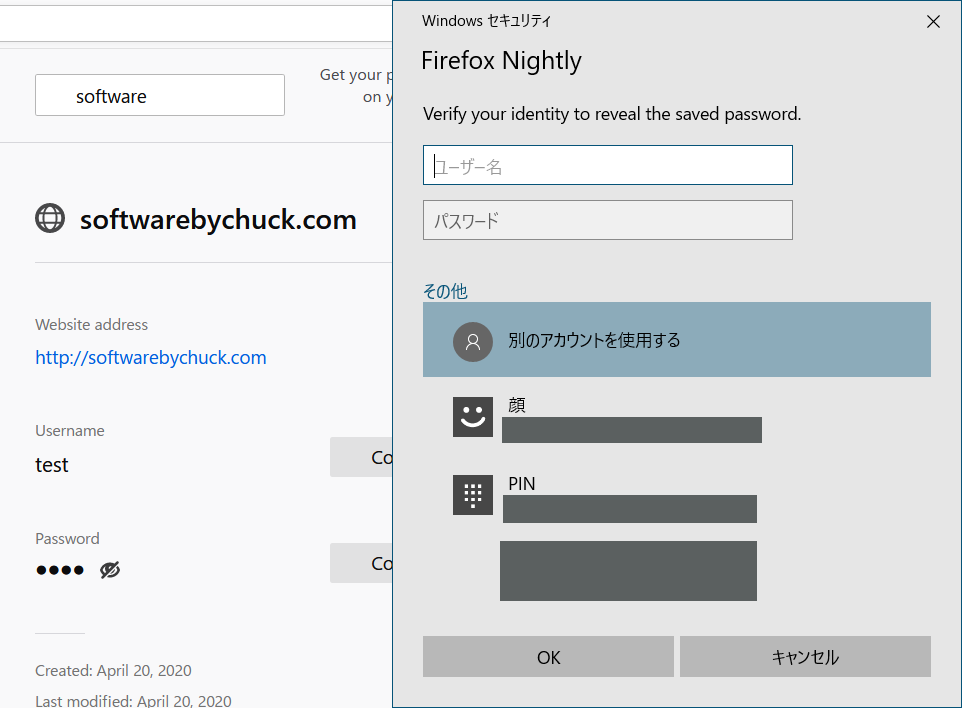
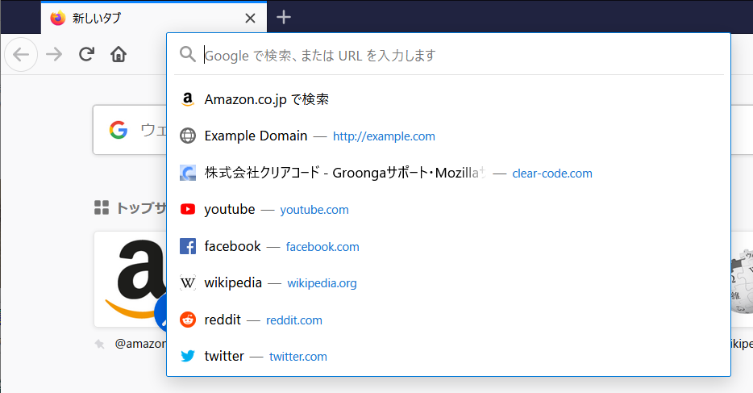

% Firefox ESR68からESR78の変更点

# 法人利用への影響が代表的な変更点

* トラッキング保護機能によるブロックの対象が拡大されました。
* 内蔵のパスワードマネージャが「Firefox Lockwise」へ置き換えられました。
* OSの認証機構や証明書データベースとの連携が強化されました。
* Flashを常に有効化するオプションが廃止されました。
* ESR版以外では、外部のアプリケーションやシステム管理者がアドオンを組み込む際の方法が制限されるようになりました。
* タスクスケジューラによる自動更新が導入される可能性があります。

# カテゴリごとの変更点

## トラッキング保護機能の改善・変更

### ブロック対象が拡大されました

* 初期状態で、サードパーティのトラッキングCookieと暗号通貨採掘をブロックするようになりました。（Firefox 69～70）
* 初期状態で、フィンガープリンティングのためのスクリプトをブロックするようになりました。（Firefox 72）
  （機能の導入自体はFirefox 69から）
* 初期状態ですべてのユーザーに対して、フィンガープリンティングのためのスクリプトをブロックするようになりました。（Firefox 72）
* SNSによるトラッキング（Facebook、Twitter、LinkdIn）がブロックされるようになりました。（Firefox 70）

### UIの変更

* プライバシー保護の状況のレポートを表示できるようになりました。（Firefox 70）
  * レポートはロケーションバーの盾アイコンをクリックして表示できます。（Firefox 71）
    
* 暗号通貨採掘のブロック状況が、プライバシー保護状況の一環として通知・表示されるようになりました。（Firefox 71）
  
* Webサイトがユーザーの位置情報を参照しているときは、ロケーションバー内にインジケータを表示するようになりました。（Firefox 70）
  

## パスワードマネージャの改善・変更

Mozillaは現在、スマートフォン向けパスワードマネージャ「Firefox Lockwise」を開発・公開しています。これに伴い、Firefoxに元々内蔵されていたパスワードマネージャは「Firefox Lockwise」のブラウザ組み込み版としてリブランディングされました。（Firefox 70～）

近年では、パスワードの運用は「定期的に変更する」「パスワードは推測されにくく覚えやすい物を使う」というかつての常識の負の側面が認識されるようになり、「人間が記憶できないような十分に複雑なパスワードを、サービスごとに使い分ける」「個々のパスワードは人間が記憶するのではなく、パスワードマネージャに記憶させる」という運用が新しい常識として広まりつつあります。Firefoxのパスワードマネージャも、この流れを受けて機能強化が進められています。

### パスワード運用の安全性の向上

* 十分な複雑さを持ったパスワードの自動生成機能が追加されました。（Firefox 70）
  
* パスワードを表示する前に、OSのアカウントの再認証を求めるようになりました。（Firefox 76～78）
  
* スクリーンリーダーを使用しているユーザーも、パスワード漏洩サイトの警告を利用できるようになりました。 （Firefox 71）
* 漏洩したパスワードのリストに含まれるパスワードや、他のアカウントですでに使われているパスワードを使い回そうとした時など、脆弱なパスワードに対して警告が表示されるようになりました。（Firefox 76～78）
  

### 利便性の向上

* パスワードの自動入力について、同じサイトの別のサブドメインの情報も列挙するようになりました。 （Firefox 71）
  
* ログインフォームの内容が変更されていた場合にのみ、ログイン情報を保存するかどうかを尋ねるようになりました。（Firefox 73）
* 保存済みの項目をアルファベット順の逆順で並べ替えられるようになりました。（Firefox 74）
  

### 他ブラウザからの情報のインポート機能の強化

* macOSでのChromeからのパスワードのインポートに対応しました。（※Windowsでは以前から可能）（Firefox 70）
* WindowsとmacOSにおいてChromiumベースのEdgeからブックマークと履歴をインポートできるようになりました。（Firefox 74）

## セキュリティ、認証関係の改善・変更

* Flashプラグインを常に有効化するオプションが廃止されました。これにより、毎回必ずFlashの有効化前に確認を求められるようになりました。（Firefox 69）
  * この影響により、64bit環境でFirefoxが32bit版かどうかを識別する必要が減ったので、フィンガープリンティングを防止しやすくなりました。（Firefox 69）
* Windows 10の2019年5月版以降で、Windows Hello経由でWeb Authentication HmacSecret拡張を使って、パスワード無しの認証をWebで行えるようになりました。（Firefox 69）
* Webサイトのセキュリティレベルの示し方が変更されました。（Firefox 70）
  
  * 安全でないHTTP→×ボタン付きの錠前アイコン（Firefox 70）
  * EV SSL→グレーの錠前アイコン（Firefox 70）
  * EV SSLのときの詳細情報が錠前アイコンをクリックして表示されるポップアップ内に移動（Firefox 70）
* 実験的な機能として、`security.osclientcerts.autoload`を有効化することによって、WindowsとmacOSでOSの証明書ストアにあるクライアント証明書を利用できるようになりました。（Windows対応はFirefox 72、macOS対応はFirefox 75から）
* TSL1.0/1.1が無効化され、TSL1.2以上の使用強制が始まる可能性があります。Covid-19の情報を提供する（各国の）政府のサイトの閲覧に支障が生じるため、この変更は今の所保留されています。（Firefox 74）
* Mozillaが把握している信頼されたWeb PKI認証局の証明書を、ローカルにキャッシュするようになりました。適切に設定されていないWebサーバーに対するHTTPSの互換性と安全性が向上しました。（Firefox 75）
* US地域の英語版ユーザーに対し、DNS over HTTPSが初期状態で有効化されました。有効化の対象は今後拡大する可能性があります。（2020年2月～）

## Firefoxの外観・UI・操作性に関する変更

* US地域の英語版ユーザーに対して、Pocketのおすすめコンテンツを新規タブに表示するようになりました。（Firefox 69）
* パネルメニュー内の「Syncにログイン」が「Firefoxアカウント」用のメニューに置き換えられました。（Firefox 70）
  
* パネルメニュー内に「新着情報」が追加されました。（Firefox 70）
  
* Firefoxのタブ内コンテンツがシステムの暗い配色モードに対応しました。（Firefox 70）
  
* 設定画面とabout:configがHTMLで置き換えられました。 （Firefox 71）
* ニュースやブログなどを閲覧した時に、通知の許可を求めるポップアップが表示されていたケースについて、ポップアップを表示せずにロケーションバーの中にアイコンが表示されるだけになりました。（Firefox 72）
  
* ロケーションバーのデザインが変更されました。これに伴い、ロケーションバーにフォーカスしただけで、よく見るサイトの一覧が表示されるようになりました。（Firefox 75）
  
* ロケーションバーにおいて、[一般的なFirefoxの問題に対する解決策を含む項目が候補に表れるようになりました。](https://support.mozilla.org/ja/kb/search-web-firefox#w_firefox-solution-cualch)現時点では英語版のみ機能します。（Firefox 75）
  

### Windows版のみの変更

* Windows 10のタスクバーのショートカットからFirefoxを起動しやすくなりました。（Firefox 69）
* Windowsにおいて、Ctrl+Iが「サイドバーでブックマークを開く」操作ではなく「ページの情報を表示する」用途に使われるようになりました。ブックマークサイドバーを開く操作は引き続きCtrl+Bで行えます。（Firefox 74）

### Windows版以外のみの変更

* macOSのFinderでファイルのダウンロード進捗が表示されるようになりました。（Firefox 69）
* Linuxでロケーションバーや検索バーをクリックしたときの振る舞いが、他のデスクトップ環境と同じになりました。（シングルクリックで「選択範囲を自動的にクリップボードにコピー」せず全選択になり、ダブルクリックで単語選択、トリプルクリックで選択範囲をクリップボードにコピーする全選択となります。）（Firefox 75）

## Webページの表示に関わる変更

* 文字の下線（と上線）が「g」の下の部分など文字を避けてレンダリングされるようになりました。（Firefox 70）
  
* ハイコントラストモードにおいて、背景画像が無効化された状態でもテキストがさらに読みやすくなりました。（Firefox 73）
* Webページの表示について、既定のズームサイズを設定できるようになりました。（文字のみ変更も可能、サイトごとにズーム率を変更可能）（Firefox 73）
  
* Application Cache APIが完全に廃止されました。（この機能はFirefox ESR68時点で既に無効化されていました）（Firefox 77）

## 動画再生に関する変更

* 音声がない動画であっても動画の自動再生をブロックできるようになりました。（Firefox 69）
* 複数の動画コーデックに対応した事により、ビデオ会議システムなどにおいて、異なるクライアントから来る動画を同時に表示できるようになりました。（Firefox 69）
* Picture-in-Picture機能（ページ内に埋め込まれた動画を再生するとき、別ウィンドウで小さく表示して再生を継続する機能）が導入されました。（Firefox 71でWindowsのみ対応、72でmacOSとLinuxに対応）
  
  * 動画の再生中に右端にPicture-in-Pictureを有効化するかどうか尋ねるポップアップが表示され、それをクリックすると有効化されます。 
    
* Windows, Linux, macOSでMP3のデコードに対応しました。 （Firefox 71）
* WebRTCでの音声・ビデオ通話について、特定の状況下で、IPアドレスをランダムなID文字列に偽装することでプライバシーを向上しました。（Firefox 74）

## インストール、更新に関する変更

* macOSにおいて、署名付きPKGインストーラが提供されるようになりました。（Firefox 69）
* Linuxにおいて、Flatpak形式のパッケージが提供されるようになりました。（Firefox 75）
* Windowsにおいて、タスクスケジューラを使ったバックグラウンドでの自動更新が実装され始めました。 [1343669 - (update-agent) [meta] Background Update Agent tracking bug](https://bugzilla.mozilla.org/show_bug.cgi?id=1343669)（Firefox 76～78）

## カスタマイズに関する変更

* userChrome.css. userContent.cssを初期状態では読み込まなくなりました。`toolkit.legacyUserProfileCustomizations.stylesheets`を`true`にすると再び有効化されます。（Firefox 69）
* [キオスクモード](https://support.mozilla.org/kb/firefox-enterprise-kiosk-mode)が実装されました。 （Firefox 71）
  コマンドラインオプションとして`-kiosk`を指定すると、UIやメニューが一切利用できない状態、かつウィンドウが最大化された状態でFirefoxが起動します。
* ドメイン指定による画像のブロック機能が廃止されました。（Firefox 72）
* 外部アプリケーションによって組み込まれたアドオンが、自動的に通常のユーザーインストールの状態に移行され、ユーザーが任意に削除できるようになりました。（Firefox 74）
  * ESR78ではこの変更を無効化できるようになる予定ですが、検証は実施できていません。
* DNS over HTTPSでは名前解決をしない例外ドメインを、ポリシーで設定できるようになりました。（Firefox 75）

## 障害発生時の調査に関する変更

* 開発ツールのネットワークモニターにおいて、ブロックされたリクエストも表示できるようになりました。（トラッキング保護の状況を把握しやすくなりました）（Firefox 69）
* アドオンのローカルストレージの内容を開発ツールで閲覧できるようになりました。（Firefox 70）

## 基本性能の向上

* Windows 10でコンテンツプロセスの実行優先度を適切に設定するようになりました。アクティブなタブにはより多く、そうでないタブにはより少なくリソースを割り当てる（バックグラウンドで再生中の動画・音声がある場合を除く）ことで、タブが多い場面でのCPU使用率が抑制される事が期待されます。（Firefox 69）
* JavaScriptベースラインインタープリタの導入により、JavaScriptの実行速度が向上しました。（Firefox 70）
* WebRenderのロールアウト対象が拡大されました。（Firefox 70、73、75）
* macOSにおいて、ページのレンダリングと動画の再生時の電力使用量を削減しました。（Firefox 70）
* macOS用のOpenH264コーデックが更新されました。（Firefox 70）
* バックグラウンドのタブで音声を再生速度を変更して再生しているときの音声品質を改善しました。（Firefox 73）

## 互換性の問題・不具合の修正

* パスに半角スペースを含むファイルを開けなくなっていた問題が修正されました。（Firefox 72）
* 古いWebページで明示的にテキストエンコーディングが指定されていないページにおける、古いテキストエンコーディングの自動判別が改善されました。（Firefox 73）
* 0patchやG DATAなどのサードパーティ製セキュリティソフトウェアをWindowsで使っているときのクラッシュを修正しました。（Firefox 73）
* Windowsにおいて互換モードあるいは独自の防護設定を伴って実行されていたときにブラウザの機能が制限される問題を修正しました。（Firefox 73）
* 印刷プレビュー終了時にFirefoxが意図せず終了してしまう問題を修正しました。（Firefox 73）
* Linuxにおいて暗号化されたコンテンツの再生中にクラッシュする問題を修正しました。（Firefox 73）
* ピン留めされたタブが失われたり並べ替わったりしてしまう問題が修正されました。（Firefox 74）
