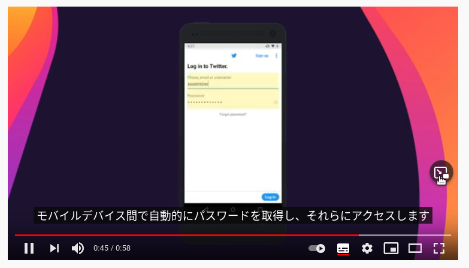

# Firefox ESR91のリリーススケジュール

[Mozillaのリリースカレンダー](https://wiki.mozilla.org/RapidRelease/Calendar)では、Firefox ESR91のリリース予定は以下の通り記載されています。

|リリース日     |通常版リリースバージョン|ESR版リリースバージョン|備考               |
|---------------|------------------------|-----------------------|-------------------|
| 2021年7月13日 | Firefox 90             | 78.12                 |                   |
| 2021年8月10日 | Firefox 91             | 78.13/91.0            |                   |
| 2021年9月7日  | Firefox 92             | 78.14/91.1            |                   |
| 2021年10月5日 | Firefox 93             | 78.15/91.2            |78ESRのサポート終了|

* Firefox 78ESRのサポートは、2021年10月5日で終了します（以後はセキュリティ更新が提供されません）。
* 日付は太平洋標準時 (UTC-0800) 基準のため、日本時間では表記の日付の約1日後がリリース日となります。
* なお、リリーススケジュールは予告なく変更される可能性があります。

### 外観、メニュー構成の変更

* 外観（テーマ）が変更されました。 (Firefox 89)
  
  * タッチ操作を前提に、UI要素間の余白が全体的に増加しました。
  * メニュー項目のラベル、並び順が再構成されました。
<!-- メニューの構成変更に包含されるため、個別の変更は列挙しない。
    * 「ヘルプ」メニューの内容が整理されました。 (Firefox 87)
    * 画像のコンテキストメニューの「画像の情報を表示」が廃止されました。 (Firefox 87)
    * ライブラリーメニューから「同期タブ」「最近のハイライト」「Pocket」が削除されました。 (Firefox 87)
-->
* ブックマークの保存と呼び出しが、より簡単になりました。ブックマークの保存場所が記憶されるようになり、ブックマークツールバーが新しいタブで自動的に表示されるようになりました。（`browser.toolbars.bookmarks.visibility`を`never`または`always`に設定することで、常に非表示または常に表示できます。） (Firefox 85)
* Firefoxの標準テーマに「Firefox AlpenGlow」が追加されました。 (Firefox 81)
  
* ページ内検索で「すべて強調表示」が有効な時に、検索結果の語句があるページ上の位置がスクロールバー上に表示されるようになりました。 (Firefox 87)
  
* スクリーンショット取得機能の呼び出し方が変わり、ページ上の右クリックメニューか、またはユーザーが任意で配置するツールバーボタンから操作を行うようになりました。 (Firefox 86～89)
<!-- 内容的に重複があるため、1項目にまとめた。
  * 「スクリーンショット」機能がアドレスバーのページアクションメニューから削除されました。スクリーンショットを取得するためには、ページ上の右クリックメニューを使うか、ツールバーカスタマイズでツールバー上にボタンを配置する必要があります。 (Firefox 88)
  * 「スクリーンショット」機能がページ上の右クリックでのコンテキストメニューから使用できるようになりました。また、ツールバーボタンを任意の位置に配置できるようになりました。 (Firefox 89)
-->
* アドレスバーから検索エンジンで検索する際の挙動が変化しました。 (Firefox 83)
  * アドレスバーに語句を入力していない状態で、アドレスバーのポップアップ最下部の検索エンジンをクリックした時の動作が、「検索を即時実行する」から、「その検索エンジンで検索する語句を入力する」に変わりました。従来の動作に戻すには、Shiftキーを押下しながら検索エンジンの項目をクリックしてください。   (Firefox 83)
    
  * アドレスバーで検索エンジンの名前の一部を入力したときに、その検索エンジンで検索を開始するモードに移れるようになりました。 (Firefox 83)
    
  * アドレスバーのポップアップ最下部の検索エンジン一覧に、ブックマーク・タブ・履歴に限定して検索するための項目が追加されました。 (Firefox 83)

### PDF.js（PDFビューワー）

* AcroFormをサポートし、PDFのフォームに入力できるようになりました。 (Firefox 83)
<!-- フォーム対応の中に含まれるため省略
  * JavaScriptが埋め込まれたフォームにも対応しています。 (Firefox 88)
-->
* PDFの署名が表示されるようになりました。 (Firefox 89)
* Windows 8以上の環境で、FirefoxをWindowsのPDFアプリとして設定できるようになりました。 (Firefox 80)
  
<!-- 説明が煩雑になるため、説明をまとめる。
  * Windows 7においては、WindowsのPDFアプリとして自身を自動登録しません。 (Firefox 85)
-->

### 印刷

* 印刷プレビュー機能の外観が刷新され、ダイアログ型のUIになりました。 (Firefox 86)
  
* 印刷時の余白の単位が言語ごとにローカライズされるようになりました。 (Firefox 88)
<!-- 単純な修正でデメリットがない物なので、省略する。
* ページ終端で余計な空白ページが印刷されてしまうことがある問題を修正しました。 (Firefox 85)
-->

### パスワードマネージャ、Cookie、プライバシー情報の保護

* パスワードマネージャにおいて、保存済みのすべてのログイン情報を1クリックで消去できるようになりました。 (Firefox 85)
* スーパークッキー（DNSキャッシュ、HSTS、デバイスIDなどのさまざまな技術的手段を用いて、Cookieに相当するユーザー識別情報を得る技法）によるユーザートラッキングからユーザーを保護するようになりました。(`privacy.partition.network_state`=`false`で従来の動作になります。) (Firefox 85)
* ストリクトモードでのトータルCookie保護が導入され、サイトごとにCookieが分離されるようになりました。 (`network.cookie.cookieBehavior`=`5`で通常モードでもサイトごとの分離が有効になります) (Firefox 86)
* HTTPリファラの既定の送信ポリシーを変更し、URLのパス部分とクエリ文字列を除去した状態で送出するようにしました。（`network.http.referer.defaultPolicy`=`3`で従来の動作になります） (Firefox 87)
* プライベートブラウジングモードにおいて、クロスサイトCookieを初期状態でブロックするようになりました。 (Firefox 89)
<!-- 単純な修正でデメリットがない物なので、省略する。
* プライベートブラウジングモードおよび、スマートブロック機能によるより厳密なトラッキング保護において、Webサイトの動作が壊れる問題の発生を軽減しました。 (Firefox 87)
-->

### 動画・音声

<!--基本的にはデメリットが無い改善の筈なので、詳細は省略する
* WebRTCの`RTX`と`Transport-cc`に対応し、音声通話の品質が向上しました (Firefox 80)
* `.xml`, `.svg`, `.webp` (ウェッピー) ファイルを表示できるようになりました。 (Firefox 81)
-->
* キーボードのメディアボタン、ヘッドセットのボタンなどで動画や音楽の再生・停止操作ができるようになりました。 (Firefox 81～87)
<!-- 類似しているので、1つにまとめて示す。
  * キーボードやヘッドセットのボタンで動画を再生・停止できるようになりました。 (Firefox 81)
  * 動画再生・音声再生のUIをキーボードで操作できるようになりました。 (Firefox 87)
-->
* 画面共有時のステータス表示で、どの画面を共有しているかが見やすくなりました。 (Firefox 83)
  
* WebRTCのピア接続の確立において、DTLS 1.0に対応しなくなりました。WebRTCサービスはDTLS 1.2以上を使用する必要があります。 (Firefox 86)
* Picture-in-Pictureの機能が強化されました。(Firefox 82～86)
  * Picture-in-PictureのUIアイコンが変更になりました。 (Firefox 82)
    
  * 複数の動画を同時にPicture-in-Pictureで表示できるようになりました。 (Firefox 86)
<!-- 単純な修正でデメリットがない物なので、省略する。
  * Picture-in-Pictureで矢印キーが正しく動作しない不具合を修正しました。 (Firefox 83)
-->

### セキュリティ

* HTTPSからHTTPにフォームを送信する時の警告を抑止できるようになりました。 (`security.warn_submit_secure_to_insecure`=`false`で従来の動作になります。) (Firefox 80)
  
* HTTPSで通信するWebサイトのみを閲覧可能にする、HTTPSオンリーモードが追加されました。 (`dom.security.https_only_mode`) (Firefox 83)
* アドオンでの`browser.identity.launchWebAuthFlow`を使用したOAuthでのログイン動作において、リダイレクト先として、フォーマット化されたループバックアドレスを使うようになりました。 (Firefox 85)
* TLSクライアント証明書を使っている組織において、`network.cors_preflight.allow_client_cert`の切り替えにより、Google Chrome互換のCORSプロトコルの取り扱いが可能になりました。 (Firefox 87)
<!-- 単純な修正でデメリットがない物なので、省略する。
* サードパティ製PKCS11モジュールとスマートカードを使用している環境での、セキュアな接続を使用したWebサイトの読み込みに失敗したりクラッシュしたりする問題を修正しました。 (Firefox 84)
-->

### 使い勝手の向上

* WindowsとMacにおいて、タッチデバイスのピンチズームに対応しました。 (Firefox 83)
<!--基本的にはデメリットが無い改善の筈なので、詳細は省略する
* Windowsにおいて、UACの権限確認が必要無い場合に、UACのダイアログを表示しないようになりました。 (Firefox 84)
-->
* リーダービューモードがローカルディスク上のHTMLファイルに対しても使用可能になりました。 (Firefox 86)
* リーダービューモードにおいて、リンクをより見やすい色で表示するようになりました。 (Firefox 86)
<!--基本的にはデメリットが無い改善の筈なので、詳細は省略する
* アドオンマネージャの画面内で、初期フォーカス状態がより使いやすい状態に設定されるようになりました。 (Firefox 87)
-->
* Backspaceキーに対する「戻る」操作へのショートカット割り当てを廃止しました。`browser.backspace_action`を`0`にすることで、ショートカットを再度有効化できます。また、代替のショートカットとしてAlt-←（macOSではCommand-←）が使用できます。 (Firefox 87)
* マイクとカメラへのアクセスの許可について、ユーザーがそのWebサイトの同じタブで同じ機器の許可を50秒以内に与えていた場合、再度の許可を求めないようになりました。 (Firefox 88)

### 集中管理

* Microsoft IntuneでMSIをインストールできない不具合が修正されました。 (Firefox 81)
* GPOやmacOSのプロファイル設定が有効な場合でも、policies.jsonが読み込まれるようになりました。競合する設定内容は、GPOやプロファイル設定の物が優先されます。 (Firefox 87)
* ポリシー設定で制御可能な範囲が拡大されました。 (Firefox 79～89)
<!-- 詳細は設定シートでカバーされるため、ここでは省略する。
  * `PrimaryPassword`ポリシーで、マスターパスワードの使用を強制できるようになりました。 (Firefox 79)
  * `Cookies`ポリシーで、現在のセッションのみCookieを許可するドメインを指定できるようになりました。 (Firefox 79)
  * `Preferences`ポリシーで設定可能な設定の範囲が拡大されました。 (Firefox 79～89)
    * `Preferences`ポリシーの設定名が一部変更になりました。 (Firefox 79)
      * 旧: `media.peerconnection.ice.obfuscate_host_addresses.whitelist`
      * 新: `media.peerconnection.ice.obfuscate_host_addresses.blocklist`
    * `Permissions`ポリシーで、バーチャルリアリティの許可通知を制御できるようになりました。 (Firefox 80)
    * `Preferences`ポリシーの設定フォーマットが変更になりました。 (Firefox 81)
    * `Preferences`ポリシーで制御可能な設定値の範囲が拡大されました。 (Firefox 81)
    * `Preferences`ポリシーで、`general.autoScroll.`・`general.smoothScroll`・`signon`から始まる設定を管理できるようになりました。 (Firefox 83)
    * Preferencesにおいて、`spellchecker.`および`pdfjs.`で名前が始まる項目の設定に対応しました。 (Firefox 84)
    * Preferences において、`app.update.`から始まる項目の大部分が、`security.tls.version.enable-deprecate`と同様にカスタマイズ可能になりました。 (Firefox 86)
    * `Preferences` ポリシーで、`gfx.`および`layers.`から始まる名前の設定を制御できるようになりました。 (Firefox 89)
  * `ManagedBookmarks`ポリシーが新しく追加されました。 (Firefox 83)
  * `OverrideFirstRunPage`ポリシーで、複数のページを設定できるようになりました。 (Firefox 83)
  * `WebsiteFilter`の機能が強化されました。(Firefox 83～)
    * `WebsiteFilter`ポリシーで、`file://`でローカルファイルをブロックできるようになりました。 (Firefox 83)
    * `WebsiteFilter`でブロックされたサイトのソースを表示できてしまっていた問題を修正しました。 (Firefox 84)
    * Webサイトがポリシーでブロックされた場合であっても、「リンク先を保存」でファイルを保存できてしまっていた問題を修正しました。 (Firefox 85)
  * `DisableTelemetry`ポリシー有効化時に、`toolkit.telemetry.archive.enabled`を`false`に設定するようになりました。 (Firefox 83)
  * `ExtensionSettings`の機能が強化されました。(Firefox 84～89)
    * ポリシーを使ったアドオンのインストールの最中にエラーが発生した場合にアドオンがインストールされない問題を修正しました。 (Firefox 84)
    * `ExtensionSettings`で、テーマの追加が可能になりました。複数のテーマが追加された場合は、最後の物が有効になります。 (Firefox 85)
    * `ExtensionSettings` ポリシーの機能が強化され、個々の拡張機能の自動更新を `updates_disabled` で無効化できるようになりました。 (Firefox 89)
  * `ShowHomeButton` が追加され、ホームボタンの初期状態での表示を制御できるようになりました。 (Firefox 88)
  * `UserMessaging` に `SkipOnboarding` オプションが追加されました。trueに設定する事で、新しいタブのページでの「ようこそ」のメッセージが抑制されます。 (Firefox 88)
  * `DisablePasswordReveal` ポリシーが使われている場合に、パスワードマネージャで新しいログイン情報を保存できない不具合が解消されました。 (Firefox 89)
  * `AllowedDomainsForApps` ポリシーが追加されました。Google Workspaceにアクセスすることを許可するドメインをカンマ区切りの文字列で指定できます。（同名のChromeのポリシーを実装したもの） (Firefox 89)
-->

### レガシーな仕様への対応終了、機能の廃止

* Adobe Flashへの対応が廃止されました。機能自体が廃止されているため、設定による再有効化はできません。 (Firefox 85)
* FTPへの対応が、Firefox 90での機能廃止を前提に、無効化されました。（`network.ftp.enabled`で有効化できます。） (Firefox 88)
  * 代替手段としてFTPを処理するアドオンを作成できるようになりましたが、現時点では実装が存在しません。引き続きFTPを利用する場合は、FTPを処理するアドオンを新たに開発する必要があります。 (Firefox 88)

### Webアプリの動作の互換性に影響する変更

* `<a>`および`<area>`要素で、`target="_blank"`を設定すると`rel="noopener"`が標準で付与されるようになりました。 (Firefox 79)
* `Windows.open()`で非標準の`outerHeight`と`outerWidth`を指定できなくなりました。 (Firefox 80)
* サンドボックスが有効化された`<iframe>`で、自動ダウンロードをブロックするようになりました。 (Firefox 81)
* `<iframe>`から、非標準の`mozallowfullscreen`属性が削除されました。 (Firefox 81)
* CSSの非標準の機能の一部が廃止・無効化されました。 (Firefox 81～88)
<!-- エンドユーザー観点では細かすぎるため、詳細は省略する。
  * 非標準の`::-moz-focus-outer`疑似要素が削除されました。 (Firefox 81)
  * 非標準の`:-moz-user-disabled`疑似クラスが削除されました。 (Firefox 82)
  * 非標準の`-moz-default-appearance`について、`scrollbar-small`と`scrollbar`への対応を廃止しました。 (Firefox 84)
  * 非標準の、テーマに関係したメディアクエリについて、以下の物がWebページからは利用できないようになりました。 (Firefox 87)
    * `-moz-mac-graphite-theme`
    * `-moz-mac-lion-theme`
    * `-moz-maemo-classic`
    * `-moz-windows-classic`
    * `-moz-windows-compositor`
    * `-moz-windows-default-theme`
    * `-moz-windows-theme`
    * `-moz-scrollbar-end-backward`
    * `-moz-scrollbar-end-forward`
    * `-moz-scrollbar-start-backward`
    * `-moz-scrollbar-start-forward`
    * `-moz-scrollbar-thumb-proportional`
    * `-moz-menubar-drag`
  * caption-sideの非標準の値（left, right, top-outside, bottom-outside）が廃止を前提に無効化されました。（`layout.css.caption-side-non-standard.enabled`で再度有効化できます。） (Firefox 87)
  * 非標準の `-moz-outline-radius` プロパティが廃止されました。 (Firefox 88)
  * 非標準の`:-moz-sumbit-invalid` 疑似クラスが、廃止を前提に無効化されました。 (Firefox 88)
  * 非標準の`:-moz-ui-invalid`と`:-moz-ui-valid`に対するスタイル付けが行われなくなりました。 (Firefox 88)
-->
* `window.name`プロパティがクロスオリジンで共有されないようになりました。 (Firefox 82)
  * `window.name`が、Webサイトをまたいだページ遷移によっても自動消去されるようになりました。 (Firefox 88)
* localhostのURLについて、常にホストのローカルループバックインターフェースとして扱うようになりました。 (Firefox 84)
* Application Cache APIが廃止されました。代わりにService Worker APIを使用する事が推奨されます。 (Firefox 84)
* ARIAのアクセシビリティ属性（aria-labeledby/describedby）の値の変更をイベントで通知するようになりました。 (Firefox 87)
* DeviceProximityEvent、UserProximityEvent、DeviceLightEventが廃止されました。 (Firefox 89)

### アドオンの互換性に影響する変更

* アドオンでウィンドウを開く操作において、非アクティブなウィンドウを開けないようになりました。 (Firefox 86)
* ブラウザーの外観の変更に伴い、テーマの配色のうち `tab_background_separator` と `toolbar_field_separator` の情報が利用されなくなりました。 (Firefox 89)
* ブラウザーの外観の変更に伴い、アドレスバー右端の「...」ボタン配下の項目をピン留めする機能が廃止されました。また、`page_action`の`pinned`属性が無視されるようになりました。 (Firefox 89)
* `page_action`で追加された項目に対する「アドレスバーから削除」操作が廃止されました。 (Firefox 89)

### アクセシビリティの向上

* スクリーンリーダーとの互換性が向上しました。 (Firefox 79～88)
<!--基本的にはデメリットが無い改善の筈なので、詳細は省略する
  * JAWSスクリーンリーダの使用時に頻繁にクラッシュする問題を解決しました。 (Firefox 79)
  * スクリーンリーダーでSVGの`title`と`desc`要素にアクセスできるようになりました。 (Firefox 79)
  * スクリーンリーダーで、隠された音声・動画の制御UIにアクセスできるようになりました。 (Firefox 81)
  * スクリーンリーダーで、音声・動画の現在時と合計時間にアクセスできるようになりました。 (Firefox 81)
  * スクリーンリーダー向けに、制御UIのラベルが追加されました。 (Firefox 81)
  * スクリーンリーダーで、ユーザーの要求がない限り、再生状態を報告しないようにしました。 (Firefox 81)
  * スクリーンリーダーの段落の検出機能に対応しました。 (Firefox 82)
  * スクリーンリーダーで、保存されたクレジットカード番号と種別にアクセスできるようになりました。 (Firefox 82)
  * スクリーンリーダーで、プリントダイアログの設定エラーにアクセスできるようになりました。 (Firefox 82)
  * スクリーンリーダーで、Google Docsの段落が検出できない問題を解決しました。 (Firefox 83)
  * スクリーンリーダーで単語毎に読み上げる時に、近くの句読点を元に正しく単語を判定できるようになりました。 (Firefox 83)
  * スクリーンリーダー使用時に、messenger.comなどのWebサイトにおいて、編集可能な要素に移動する操作で、誤って編集不可能な要素に移動しないようになりました。 (Firefox 86)
  * Orcaスクリーンリーダーのマウスレビュー機能が、タブの切り替え後も正常に動作するようになりました。 (Firefox 86)
  * スクリーンリーダー使用時に、複数列に渡るセルを持つ表のヘッダー行を誤って読み上げないようになりました。 (Firefox 86)
  * スクリーンリーダーがHTMLのmeta要素を読み上げるようになりました。 (Firefox 87)
  * macOSにおいて、組み込みのスクリーンリーダーであるVoiceOverに全面的に対応しました。 (Firefox 87)
  * スクリーンリーダーにおいて、視覚的に非表示になっているコンテンツ（Google Helpのパネルなど）が読み上げられてしまわないようになりました。 (Firefox 88)
-->
* ハイコントラストモードにおいて、設定画面のメニュー項目の内容を読めない状態になっていた問題が解消されました。 (Firefox 88)

### その他のパフォーマンス向上

* WebRenderが有効化される範囲が拡大しました。(Firefox 79～84)
<!--エンドユーザー観点では重要で無い情報のため、詳細は省略する
  * Intel/AMD GPUを搭載したWindowsにおいて、WebRenderが有効化されるようになりました。 (Firefox 79)
  * Windowsにおいて、WebRenderが適用されるユーザーが拡大しました。 (Firefox 82)
  * Windows 7/8およびmacOS 10.12-10.15において、WebRenderが有効化されるようになりました。 (Firefox 83)
  * macOS Big Sur、Intel Gen6 GPU搭載のWindows、Windows 7およびWindows 8が動作するインテル製チップセット搭載のラップトップにおいて、WebRenderが有効化されました。 (Firefox 84)
-->
<!--基本的にはデメリットが無い改善の筈なので、詳細は省略する
-->
* Windowsにおいて、Canvasのパフォーマンスが低下することがある問題を修正しました。 (Firefox 84)
<!--次の項目に包含されるため、省略する
* 日付および時刻の入力フィールドの幅を、より正しく計算するようになりました。 (Firefox 86)
-->
* Webページのフォームコントロールの実装が刷新され、ユーザー体験とページ読み込み速度が向上しました。 (Firefox 89)

<!--基本的にはデメリットが無い改善の筈なので、詳細は省略する
### その他の安定性の向上

* ESR78において、インターネットからダウンロードしたWindowsの`.lnk`ショートカットが開かれない問題が修正されました。この修正はESR78にもバックポート済みです。 (Firefox 81)
* さまざまなサードパーティ製アンチウィルス製品によりクラッシュする問題を修正しました。 (Firefox 84)
* Cache APIの予期しない状態によってクラッシュする問題を修正しました。 (Firefox 85)
* ファイルシステムの破壊を引き起こしうる、NTFSの特定のパスへのアクセスを防ぐようになりました。 (Firefox 85)
* Firefoxの新しいバージョンが存在しない場合でも自動更新の通知が行われる場合があった問題を修正しました。 (Firefox 85)
* Webページのスクリプトによるページ読み込み動作に際し、ウィンドウのフォーカスが意図せず変更されてしまう問題を修正しました。 (Firefox 86)
* タブのグループを管理する拡張機能で意図しない不具合が発生していた問題を修正しました。 (Firefox 86)
* 新しいRDDプロセスでの動画のデコード処理により、さらに動作が安全になりました。 (Firefox 86)
* Widevineプラグインの更新の影響により発生していた、動画再生の問題が解消されました。 (Firefox 88)
* Intel Gen6グラフィックチップの環境において、TwitterおよびWebRTCの動画再生の問題が解消されました。 (Firefox 88)
-->

### その他、macOSのみの変更

* macOS 10.9 (Maverics) 10.10 (Yosemite) 10.11 (El Capitan) のサポートが終了しました。 (Firefox 79)
* macOSにおいて、`Option + Command + Shift + Right`でPicture-in-Pictureを有効にできるようになりました。 (Firefox 82)
* Apple Silicon搭載機のmacOSで利用できるようになりました。 (Firefox 83～86)
<!--段階的な改善の結果なので、各段階の詳細は省略する。
  * Rosseta 2エミュレーションにより、Apple SilliconデバイスでFirefoxを利用できるようになりました。 (Firefox 83)
  * Apple Silicon搭載機のmacOSにネイティブ対応し、パフォーマンスが大幅に向上しました。 (Firefox 84)
  * Apple Silicon搭載機のmacOSにおいて、OSのバージョン判別の失敗によりUnity JSを使用したゲームがロードされない場合がある問題を修正しました。 (Firefox 84)
  * Apple Silicon搭載機のmacOSにおいて、SPNEGOを用いた認証処理でのクラッシュを修正しました。 (Firefox 85)
  * Apple Silicon搭載機での、システムがスリープから復帰した後にFirefoxが反応しなくなる問題を修正しました。 (Firefox 86)
-->
<!--基本的にはデメリットが無い改善の筈なので、詳細は省略する
* macOSでの、起動時にフリーズする問題を修正しました。 (Firefox 85)
-->
* macOSにおいて、IntuneでFirefoxのパッケージをインストールできなかった不具合が修正されました。pkgファイルをintunemacファイルに変換する前に、ファイル名にスペースを含まない状態にする必要があります。 (Firefox 86)
* macOSにおいて、フォント種別monospaceに対する既定のフォントがMenioに変更されました。 (Firefox 88)
* macOSでのユーザー体験が向上し、アプリケーションの外観や振る舞いがよりmacOSアプリらしい物になりました。(Firefox 89)
<!--基本的にはデメリットが無い改善の筈なので、詳細は省略する
  * macOSにおいて、ページ終端までスクロールした場合に跳ね返る動作（バウンス動作）が実装されました。 (Firefox 89)
  * macOSにおいて、トラックパッドを二本指でダブルタップするか、マジックマウスを1本指でダブルタップすると、当該要素にフォーカスするようにズームします。 (Firefox 89)
  * macOSにおいて、ページ内のコンテキストメニューがOSネイティブの外観になり、Darkモードに対応しました。 (Firefox 89)
  * macOSにおいて、画像表示の際の色再現性が向上しました。 (Firefox 89)
  * macOSにおいて、フルスクリーンモードでマウスを画面最上部に移動した際に、システムのメニューバーが表示されても、タブがその下に隠れないようになりました。 (Firefox 89)
  * macOSにおいて、フルスクリーンモードでツールバーを非表示にしてより高い没入感を得られる世になりました。（Windows、Linuxの動作と同様になりました。） (Firefox 89)
-->
* macOSに固有の既知の不具合・制限事項があります。 (Firefox 84)
  * Apple Silicon搭載機のmacOSにおいて、Rosettaシステムがインストールされていない場合に、暗号化されたコンテンツの再生でエラーが発生します。（問題の解消にはRosettaシステムのインストールが必要です。） (Firefox 84)
  * macOSにおいて、Cylanceアンチウィルスを使用している場合に、Firefoxがマルウェアと誤判定されるためにインストールに失敗する問題があります。 (Firefox 84)

### その他、Linuxのみの変更

<!--基本的にはデメリットが無い改善の筈なので、詳細は省略する
* Linuxにおいて、共有メモリの割り当てにより現代的な方法を使うようになり、パフォーマンスおよびDockerとの互換性が向上しました。 (Firefox 84)
-->
* Linuxにおいて、flatpakでFirefoxをインストールした場合に、外部URLスキームハンドラが正しく登録されない問題を修正しました。 (Firefox 85)
* LinuxとAndroidにおいて、スタッククラッシュ攻撃に対する保護機構が有効になりました。 (Firefox 86)
<!--基本的にはデメリットが無い改善の筈なので、詳細は省略する
* Linuxでの、Firefox起動時に頻繁にクラッシュする問題を修正しました。 (Firefox 86)
-->
* Linuxにおいて、すべてのデスクトップ環境でWebRenderが有効化されました。 (Firefox 89)
* Linuxにおいて、タッチパッドでのピンチイン・ピンチアウトでのズーム操作がよりスムーズになりました。 (Firefox 88)

### その他、日本以外の地域のみの変更

* 「新しいタブ」ページにPocketのおすすめが表示される範囲が拡大しました。(Firefox 79～83)
  * ドイツ語圏 (Firefox 79)
  * オーストリア・ベルギー・スイス (Firefox 81)
  * インド英語 (Firefox 83)
* クレジットカード情報の自動記入機能が地域限定で導入されました。 (Firefox 81～86)
  * アメリカ (Firefox 81)
  * カナダ地域 (Firefox 86)
* シレジア語ロケールに対応しました。 (Firefox 87)

## リンク

### リリースノート

* [Firefox 79.0](https://www.mozilla.org/en-US/firefox/79.0/releasenotes/)
* [Firefox 80.0](https://www.mozilla.org/en-US/firefox/80.0/releasenotes/)
  * [Firefox 80.0.1](https://www.mozilla.org/en-US/firefox/80.0.1/releasenotes/)
* [Firefox 81.0](https://www.mozilla.org/en-US/firefox/81.0/releasenotes/)
  * [Firefox 81.0.1](https://www.mozilla.org/en-US/firefox/81.0.1/releasenotes/)
  * [Firefox 81.0.2](https://www.mozilla.org/en-US/firefox/81.0.2/releasenotes/)
* [Firefox 82.0](https://www.mozilla.org/en-US/firefox/82.0/releasenotes/)
  * [Firefox 82.0.1](https://www.mozilla.org/en-US/firefox/82.0.1/releasenotes/)
  * [Firefox 82.0.2](https://www.mozilla.org/en-US/firefox/82.0.2/releasenotes/)
  * [Firefox 82.0.3](https://www.mozilla.org/en-US/firefox/82.0.3/releasenotes/)
* [Firefox 83.0](https://www.mozilla.org/en-US/firefox/83.0/releasenotes/)
* [Firefox 84.0](https://www.mozilla.org/en-US/firefox/84.0/releasenotes/)
  * [Firefox 84.0.1](https://www.mozilla.org/en-US/firefox/84.0.1/releasenotes/)
  * [Firefox 84.0.2](https://www.mozilla.org/en-US/firefox/84.0.2/releasenotes/)
* [Firefox 85.0](https://www.mozilla.org/en-US/firefox/85.0/releasenotes/)
  * [Firefox 85.0.1](https://www.mozilla.org/en-US/firefox/85.0.1/releasenotes/)
  * [Firefox 85.0.2](https://www.mozilla.org/en-US/firefox/85.0.2/releasenotes/)
* [Firefox 86.0](https://www.mozilla.org/en-US/firefox/86.0/releasenotes/)
  * [Firefox 86.0.1](https://www.mozilla.org/en-US/firefox/86.0.1/releasenotes/)
* [Firefox 87.0](https://www.mozilla.org/en-US/firefox/87.0/releasenotes/)
* [Firefox 88.0](https://www.mozilla.org/en-US/firefox/88.0/releasenotes/)
  * [Firefox 88.0.1](https://www.mozilla.org/en-US/firefox/88.0.1/releasenotes/)
* [Firefox 89.0](https://www.mozilla.org/en-US/firefox/89.0/releasenotes/)

### その他

* [OS X 10.9/10.10/10.11 サポート終了](https://support.mozilla.org/en-US/kb/firefox-mac-osx-users-esr)
