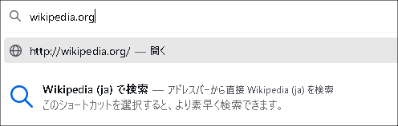

# Firefox ESR91のリリーススケジュール

[Mozillaのリリースカレンダー](https://wiki.mozilla.org/RapidRelease/Calendar)では、Firefox ESR91のリリース予定は以下の通り記載されています。

|リリース日     |通常版リリースバージョン|ESR版リリースバージョン|備考               |
|---------------|------------------------|-----------------------|-------------------|
| 2021年7月13日 | Firefox 90             | 78.12                 |                   |
| 2021年8月10日 | Firefox 91             | 78.13/91.0            |                   |
| 2021年9月7日  | Firefox 92             | 78.14/91.1            |                   |
| 2021年10月5日 | Firefox 93             | 78.15/91.2            |78ESRのサポート終了|

* Firefox 78ESRのサポートは、2021年10月5日で終了します（以後はセキュリティ更新が提供されません）。
* 日付は太平洋標準時 (UTC-0800) 基準のため、日本時間では表記の日付の約1日後がリリース日となります。
* なお、リリーススケジュールは予告なく変更される可能性があります。

## Firefox 79

* Intel/AMD GPUを搭載したWindowsにおいて、WebRenderが有効化されるようになりました。
* 「新しいタブ」ページにPocketのおすすめが表示されるようになりました（ドイツのみ）
* macOS 10.9 (Maverics) 10.10 (Yosemite) 10.11 (El Capitan) のサポートが終了しました。

### 開発

* `<a>`および`<area>`要素で、`target="_blank"`を設定すると`rel="noopener"`が標準で付与されるようになりました。

### アクセシビリティ

* JAWSスクリーンリーダの使用時に頻繁にクラッシュする問題を解決しました。
* スクリーンリーダーでSVGの`title`と`desc`要素にアクセスできるようになりました。

### ポリシー設定

* `PrimaryPassword`ポリシーで、マスターパスワードの使用を強制できるようになりました。
* `Cookies`ポリシーで、現在のセッションのみCookieを許可するドメインを指定できるようになりました。
* `Preferences`ポリシーの設定名が一部変更になりました。
  * 旧: `media.peerconnection.ice.obfuscate_host_addresses.whitelist`
  * 新: `media.peerconnection.ice.obfuscate_host_addresses.blocklist`

## Firefox 80 / 80.0.1

* FirefoxをWindowsのPDFアプリとして設定できるようになりました。
  
* HTTPSからHTTPにフォームを送信する時の警告を抑止可能になりました (`security.warn_submit_secure_to_insecure`)
  
* WebRTCの`RTX`とTransport-cc`に対応し、音声通話の品質が向上しました

### ポリシー設定

* `Permissions`ポリシーで、バーチャルリアリティの許可通知を制御できるようになりました。

### 開発

* `Windows.open()`で非標準の`outerHeight/`outerWidth`を指定できなくなりました。

## Firefox 81

* キーボードやヘッドセットで動画を再生・停止できるようになりました。
* FIrefoxの標準テーマに「Firefox AlpenGlow」が追加されました。
  
* クレジットカード情報の自動記入をサポートしました（アメリカのみ）
* `.xml`, `.svg`, `.webp` (ウェッピー) ファイルを表示できるようになりました。
* 「新しいタブ」ページにPocketのおすすめが表示されるようになりました（オーストリア・ベルギー・スイス）
* Windowsの`.lnk`ショートカットをサポートしました。
* Microsoft IntuneでMSIをインストールできない不具合が修正されました。

### ポリシー設定

* `Preferences`ポリシーの設定フォーマットが変更になりました。
* `Preferences`ポリシーで制御可能な設定値の範囲が拡大されました。

### 開発

* サンドボックスが有効化された`<iframe>`で、自動ダウンロードをブロックするようになりました。
* `<iframe>`から、非標準の`mozallowfullscreen`属性が削除されました。
* 非標準の`::-moz-focus-outer`疑似要素が削除されました。

### アクセシビリティ

* スクリーンリーダーで、隠された音声・動画の制御UIにアクセスできるようになりました。
* スクリーンリーダーで、音声・動画の現在時と合計時間にアクセスできるようになりました。
* スクリーンリーダー向けに、制御UIのラベルが追加されました。
* スクリーンリーダーで、ユーザーの要求がない限り、再生状態を報告しないようにしました。

## Firefox 82 / 82.0.1 / 82.0.2 / 82.0.3

* ピクチャーインピクチャのUIアイコンが変更になりました。
  
* Macにおいて、`Option + Command + Shift + Right`でピクチャーインピクチャで表示できるようになりました。
* Windowsにおいて、WebRenderが適用されるユーザーが拡大しました。

### アクセシビリティ

* スクリーンリーダーの段落の検出機能に対応しました。
* スクリーンリーダーで、保存されたクレジットカード番号と種別にアクセスできるようになりました。
* スクリーンリーダーで、プリントダイアログの設定エラーにアクセスできるようになりました。

### 開発

* `:-moz-user-disabled`疑似クラスが削除されました。
* `window.name`プロパティがクロスオリジンで共有されないようになりました。

## Firefox 83

* HTTPSオンリーモードが追加されました (`dom.security.https_only_mode`)
* WindowsとMacにおいて、タッチデバイスのピンチズームに対応しました。
* 画面共有時のステータス表示で、どの画面を共有しているかが見やすくなりました。
  
* 検索パネルの検索エンジンをクリック時に、検索モードに移行するようになりました。従来の動作（検索を即時実行する）は、Shiftキーを押下しながらクリックすることで呼び出せます。  
  
* アドレスバーから、個別の検索エンジンで直接検索できるようになりました。
  
* AcroFormをサポートし、FirefoxでPDFのフォームを入力できるようになりました。
* 「新しいタブ」ページにPocketのおすすめが表示されるようになりました（インド英語版のみ）
* Rosseta 2エミュレーションにより、Apple SilliconデバイスでFirefoxを利用できるようになりました。
* Windows 7/8およびmacOS 10.12-10.15において、WebRenderが有効化されるようになりました。
* ピクチャーインピクチャーで矢印キーが正しく動作しない不具合を修正しました。

### アクセシビリティ

* スクリーンリーダーで、Google Docsの段落が検出できない問題を解決しました。
* スクリーンリーダーで単語毎に読み上げる時に、近くの句読点を元に正しく単語を判定できるようになりました。

### ポリシー設定

* `ManagedBookmarks`ポリシーが新しく追加されました。
* `Preferences`ポリシーで、`general.autoScroll.`・`general.smoothScroll`・`signon`から始まる設定を管理できるようになりました。
* `OverrideFirstRunPage`ポリシーで、複数のページを設定できるようになりました。
* `WebsiteFilter`ポリシーで、`file://`でローカルファイルをブロックできるようになりました。
* `DisableTelemetry`ポリシー有効化時に、`toolkit.telemetry.archive.enabled`を`false`に設定するようになりました。

## Firefox84

* Apple Silicon搭載機のmacOSにネイティブ対応し、パフォーマンスが大幅に向上しました。
* macOS Big Sur、Intel Gen6 GPU搭載のWindows、Windows 7およびWindows 8が動作するインテル製チップセット搭載のラップトップにおいて、WebRenderが有効化されました。
* Linuxにおいて、共有メモリの割り当てにより現代的な方法を使うようになり、パフォーマンスおよびDockerとの互換性が向上しました。
* Adobe Flashに対応する最後のバージョンとなりました。
* Windowsにおいて、UACの権限確認が必要無い場合に、UACのダイアログを表示しないようになりました。
* Apple Silicon搭載機のmacOSにおいて、Rosettaシステムがインストールされていない場合に、暗号化されたコンテンツの再生でエラーが発生します。（問題の解消にはRosettaシステムのインストールが必要です。）
* macOSにおいて、Cylanceアンチウィルスを使用しているあばいに、Firefoxがマルウェアと誤判定されるためにインストールに失敗する問題があります。
* サードパティ製PKCS11モジュールとスマートカードを使用している環境での、セキュアな接続を使用したWebサイトの読み込みに失敗したりクラッシュしたりする問題を修正しました。
* Windowsにおいて、Canvasのパフォーマンスが低下することがある問題を修正しました。
* Apple Silicon搭載機のmacOSにおいて、OSのバージョン判別の失敗によりUnity JSを使用したゲームがロードされない場合がある問題を修正しました。
* さまざまなサードパーティ製アンチウィルス製品によりクラッシュする問題を修正しました。

### ポリシー設定

* WebsiteFilterでブロックされたサイトのソースを表示できてしまっていた問題を修正しました。
* ポリシーを使ったアドオンのインストールの最中にエラーが発生した場合にアドオンがインストールされない問題を修正しました。
* Preferencesにおいて、`spellchecker.`および`pdfjs.`で名前が始まる項目の設定に対応しました。

### Web開発者向けの変更

* 非標準の`-moz-default-appearance`について、`scrollbar-small`と`scrollbar`への対応を廃止しました。
* localhostのURLについて、常にホストのローカルループバックインターフェースとして扱うようになりました。
* Application Cache APIが廃止されました。代わりにService Worker APIを使用する事が推奨されます。

## Firefox85

* スーパークッキー（さまざまな技術的手段を用いて、Cookieに相当するユーザー識別情報を保存する技法）によるユーザートラッキングからユーザーを保護するようになりました。
* ブックマークの保存と呼び出しがより簡単になりました。ブックマークの保存場所が記憶される他、ブックマークツールバーが新しいタブで自動的に表示されるようになりました。
* パスワードマネージャにおいて、保存済みのすべてのログイン情報を1クリックで消去できるようにアンリ増した。
* Flashのサポートが廃止されました。再度有効化する機能もありません。
* Windows 7において、既定のPDFビューワーとして自身をファイルの関連付けに登録しないようになりました。
* Webサイトがポリシーでブロックされた場合であっても、「リンク先を保存」でファイルを保存できてしまっていた問題を修正しました。
* Firefoxの新しいバージョンが存在しない場合でも自動更新の通知が行われる場合があった問題を修正しました。
* 阿遠でのbrowser.identity.launchWebAuthFlowを使用したOAuthでのログイン動作において、リダイレクト先として、フォーマット化されたループバックアドレスを使うようになりました。
* ファイルシステムの破壊を引き起こしうる、NTFSの特定のパスへのアクセスを防ぐようになりました。
* Apple Silicon搭載機のmacOSにおいて、SPNEGOを用いた認証処理でのクラッシュを修正しました。
* ページ終端で余計な空白ページが印刷されてしまうことがある問題を修正しました。
* Cache APIの予期しない状態によってクラッシュする問題を修正しました。
* Linuxにおいて、flatpakでFirefoxをインストールした場合に、外部URLスキームハンドラが正しく登録されない問題を修正しました。
* macOSでの、起動時にフリーズする問題を修正しました。

### ポリシー設定

* ExtensionSettingsで、テーマの追加が可能になりました。複数のテーマが追加された場合は、最後の物が有効になります。

## Firefox86

* 複数の動画を同時にPicture-in-Pictureで表示できるようになりました。
* ストリクトモードでのトータルCookie保護が導入され、サイトごとにCookieが管理されるようになりました。
* 印刷プレビュー機能が刷新されました。
  
* クレジットカード情報の自動入力機能を、カナダ地域向けにも有効化しました。
* リーダービューモードがローカルディスク上のHTMLファイルに対しても使用可能になりました。
* スクリーンリーダー使用時に、messenger.comなどのWebサイトにおいて、編集可能な要素に移動する操作で、誤って編集不可能な要素に移動しないようになりました。
* Orcaスクリーンリーダーのマウスレビュー機能が、タブの切り替え後も正常に動作するようになりました。
* スクリーンリーダー使用時に、複数列に渡るセルを持つ表のヘッダー行を誤って読み上げないようになりました。
* リーダービューモードにおいて、リンクをより見やすい色で表示するようになりました。
* LinuxとAndroidにおいて、スタッククラッシュ攻撃に対する保護機構が有効になりました。
* WebRTCのピア接続の確立において、DTLS 1.0に対応しなくなりました。WebRTCサービスはDTLS 1.2以上を使用する必要があります。
* 新しいRDDプロセスでの動画のデコード処理により、さらに動作が安全になりました。
* macOSにおいて、IntuneでFirefoxのパッケージをインストールできなかった不具合を修正しました。pkgファイルをintunemacファイルに変換する前に、ファイル名にスペースを含まない状態にする必要があります。
* Apple Silicon搭載機での、システムがスリープから復帰した後にFirefoxが反応しなく案る問題を修正しました。
* Webページのスクリプトによるページ読み込み動作に際し、ウィンドウのフォーカスが意図せず変更されてしまう問題を修正しました。
* 日付および時刻の入力フィールドの幅を、より正しく計算するようになりました。
* タブのグループを管理する拡張機能で意図しない不具合が発生していた問題を修正しました。
* Linuxでの、Firefox起動時に頻繁にクラッシュする問題を修正しました。

### ポリシー設定

* Preferences において、`app.update.`から始まる項目の大部分が、`security.tls.version.enable-deprecate`と同様にカスタマイズ可能になりました。

### Web開発者向けの変更

* アドオンでウィンドウを開く操作をする際に、非アクティブなウィンドウを開けないようになりました。

## Firefox87

* プライベートブラウジングモードおよび、スマートブロック機能によるより厳密なトラッキング保護において、Webサイトの動作が壊れる問題の発生を軽減しました。
* HTTPリファラの既定の送信ポリシーを変更し、URLのパス部分とクエリ文字列を除去した状態で送出するようにしました。
* ページ内検索で「すべて強調表示」がOKの時に、検索結果があるページ上の位置をスクロールバー上に表示するようにしました。
* シレジア語ロケールに対応しました。
* 動画再生・音声再生のUIをキーボードで操作できるようになりました。
* スクリーンリーダーがHTMLのmeta要素を読み上げるようになりました。
* アドオンマネージャの画面内で、初期フォーカス状態がより使いやすい状態に設定されるようになりました。
* ARIAのアクセシビリティ属性（aria-labeledby/describedby）の値の変更をイベントで通知するようになりました。
* Backspaceキーに対する「戻る」操作へのショートカット割り当てを廃止しました。`browser.backspace_action`を`0`にすることで、ショートカットを再度有効化できます。また、代替のショートカットとしてAlt-←（macOSではCommand-←）が使用できます。
* ライブラリーメニューから「同期タブ」「最近のハイライト」「Pocket」を削除しました。
* 「ヘルプ」メニューの内容を整理しました。
* 画像のコンテキストメニューの「画像の情報を表示」を廃止しました。
* TLSクライアント証明書を使っている組織において、`network.cors_preflight.allow_client_cert`の切り替えにより、Google Chrome互換のCORSプロトコルの取り扱いが可能になりました。
* macOSにおいて、組み込みのスクリーンリーダーであるVoiceOverに全面的に対応しました。

### ポリシー設定

* GPOやmacOSのプロファイル設定が有効な場合でも、policies.jsonが読み込まれるようになりました。競合する設定内容は、GPOやプロファイル設定の物が優先されます。

### Web開発者向けの変更

* 非標準の、テーマに関係したメディアクエリについて、以下の物がWebページからは利用できないようになりました。
  * `-moz-mac-graphite-theme`
  * `-moz-mac-lion-theme`
  * `-moz-maemo-classic`
  * `-moz-windows-classic`
  * `-moz-windows-compositor`
  * `-moz-windows-default-theme`
  * `-moz-windows-theme`
  * `-moz-scrollbar-end-backward`
  * `-moz-scrollbar-end-forward`
  * `-moz-scrollbar-start-backward`
  * `-moz-scrollbar-start-forward`
  * `-moz-scrollbar-thumb-proportional`
  * `-moz-menubar-drag`
* caption-sideの非標準の値（left, right, top-outside, bottom-outside）が廃止を前提に無効化されました。（`layout.css.caption-side-non-standard.enabled`で再度有効化できます。）

## Firefox88 / 88.0.1

* Widevineプラグインの更新の影響により発生していた、動画再生の問題が解消されました。
* Gen6グラフィックチップの環境において、TwitterおよびWebRTCの動画再生の問題が解消されました。
* ハイコントラストモードにおいて、設定画面のメニュー項目の内容を読めない状態になっていた問題が解消されました。
* PDFプレビューが、JavaScriptが埋め込まれたフォームに対応しました。
* 印刷時の余白の単位が言語ごとにローカライズされるようになりました。
* Webサイトをまたいだプライバシー情報の漏洩を防ぐため、JavaScriptでのwindow.nameが、Webサイトをまたいだ遷移で自動消去されるようになりました。
* スクリーンリーダーにおいて、視覚的に非表示になっているコンテンツ（Google Helpのパネルなど）が読み上げられてしまわないようになりました。
* マイクとカメラへのアクセスの許可について、ユーザーがそのWebサイトの同じタブで同じ機器の許可を50秒以内に与えていた場合、再度の許可を求めないようになりました。
* 「スクリーンショット」機能がアドレスバーのページアクションメニューから削除されました。スクリーンショットを取得するためには、ページ上の右クリックメニューを使うか、ツールバーカスタマイズでツールバー上にボタンを配置する必要があります。
* FTPへの対応が、Firefox 90での機能廃止を前提に、無効化されました。（`network.ftp.enabled`で有効化できます。
* Linuxにおいて、タッチパッドでのピンチイン・ピンチアウトでのズーム操作がよりスムーズになりました。

### ポリシー設定

* ShowHomeButton が追加され、ホームボタンの初期状態での表示を制御できるようになりました。
* UserMessaging に SkipOnboarding オプションが追加されました。trueに設定する事で、新しいタブのページでの「ようこそ」のメッセージが抑制されます。

### Web開発者向けの変更

* macOSにおいて、フォント種別monospaceに対する既定のフォントがMenioに変更されました。
* 非標準の `-moz-outline-radius` プロパティが廃止されました。
* 非標準の`:-moz-sumbit-invalid` 疑似クラスが、廃止を前提に無効化されました。
* 非標準の`:-moz-ui-invalid`と`:-moz-ui-valid`に対するスタイル付けが行われなくなりました。
* FTP廃止に備えて、代替手段としてFTPを処理するアドオンを作成できるようになりました。

## Firefox89

* 外観（テーマ）が変更されました。
  * タッチ操作を前提に、UI要素間の余白が全体的に増加しました。
  * メニュー項目のラベル、並び順などが部分的に変化しました。
* プライベートブラウジングモードにおいて、クロスサイトCookieを初期状態でブロックするようになりました。
* Webページのフォームコントロールの実装が刷新され、ユーザー体験とページ読み込み速度が向上しました。
* 「スクリーンショット」機能がページ上の右クリックでのコンテキストメニューから使用できるようになりました。また、ツールバーボタンを任意の位置に配置できるようになりました。
* PDFファイルのプレビュー時に署名が表示されるようになりました。

### Windows以外のプラットフォームでの変更

* macOSにおいて、ページ終端までスクロールした場合に跳ね返る動作（バウンス動作）が実装されました。
* macOSにおいて、トラックパッドを二本指でダブルタップするか、マジックマウスを1本指でダブルタップしると、当該要素にフォーカスするようにズームします。
* macOSにおいて、ページ内のコンテキストメニューがOSネイティブの外観になり、Darkモードに対応しました。
* macOSにおいて、画像表示の際の色再現性が向上しました。
* macOSにおいて、フルスクリーンモードでマウスを画面最上部に移動した際に、システムのメニューバーが表示されても、タブがその下に隠れないようになりました。
* macOSにおいて、フルスクリーンモードでツールバーを非表示にしてより高い没入感を得られる世になりました。（Windows、Linuxの動作と同様になりました。）
* Linuxにおいて、すべてのデスクトップ環境でWebRenderが有効化されました。

### ポリシー設定

* `DisablePasswordReveal` ポリシーが使われている場合に、パスワードマネージャで新しいログイン情報を保存できない不具合が解消されました。
* `AllowedDomainsForApps` ポリシーが追加されました。Google Workspaceにアクセスすることを許可するドメインをカンマ区切りの文字列で指定できます。（同名のChromeのポリシーを実装したもの）
* `ExtensionSettings` ポリシーの機能が強化され、個々の拡張機能の自動更新を `updates_disabled` で無効化できるようになりました。
* `Preferences` ポリシーで、`gfx.`および`layers.`から始まる名前の設定を制御できるようになりました。

### Web開発者・アドオン開発者向けの変更

* DeviceProximityEvent、UserProximityEvent、DeviceLightEventが廃止されました。
* ブラウザーの外観の変更に伴い、テーマの配色のうち `tab_background_separator` と `toolbar_field_separator` の情報が利用されなくなりました。
* ブラウザーの外観の変更に伴い、アドレスバー右端の「...」ボタン配下の項目をピン留めする機能が廃止されました。また、`page_action`の`pinned`属性が無視されるようになりました。
* `page_action`で追加された項目に対する「アドレスバーから削除」操作が廃止されました。

## リンク

### リリースノート

* [Firefox 79.0](https://www.mozilla.org/en-US/firefox/79.0/releasenotes/)
* [Firefox 80.0](https://www.mozilla.org/en-US/firefox/80.0/releasenotes/)
  * [Firefox 80.0.1](https://www.mozilla.org/en-US/firefox/80.0.1/releasenotes/)
* [Firefox 81.0](https://www.mozilla.org/en-US/firefox/81.0/releasenotes/)
  * [Firefox 81.0.1](https://www.mozilla.org/en-US/firefox/81.0.1/releasenotes/)
  * [Firefox 81.0.2](https://www.mozilla.org/en-US/firefox/81.0.2/releasenotes/)
* [Firefox 82.0](https://www.mozilla.org/en-US/firefox/82.0/releasenotes/)
  * [Firefox 82.0.1](https://www.mozilla.org/en-US/firefox/82.0.1/releasenotes/)
  * [Firefox 82.0.2](https://www.mozilla.org/en-US/firefox/82.0.2/releasenotes/)
  * [Firefox 82.0.3](https://www.mozilla.org/en-US/firefox/82.0.3/releasenotes/)
* [Firefox 83.0](https://www.mozilla.org/en-US/firefox/83.0/releasenotes/)
* [Firefox 84.0](https://www.mozilla.org/en-US/firefox/84.0/releasenotes/)
  * [Firefox 84.0.1](https://www.mozilla.org/en-US/firefox/84.0.1/releasenotes/)
  * [Firefox 84.0.2](https://www.mozilla.org/en-US/firefox/84.0.2/releasenotes/)
* [Firefox 85.0](https://www.mozilla.org/en-US/firefox/85.0/releasenotes/)
  * [Firefox 85.0.1](https://www.mozilla.org/en-US/firefox/85.0.1/releasenotes/)
  * [Firefox 85.0.2](https://www.mozilla.org/en-US/firefox/85.0.2/releasenotes/)
* [Firefox 86.0](https://www.mozilla.org/en-US/firefox/86.0/releasenotes/)
  * [Firefox 86.0.1](https://www.mozilla.org/en-US/firefox/86.0.1/releasenotes/)
* [Firefox 87.0](https://www.mozilla.org/en-US/firefox/87.0/releasenotes/)
* [Firefox 88.0](https://www.mozilla.org/en-US/firefox/88.0/releasenotes/)
  * [Firefox 88.0.1](https://www.mozilla.org/en-US/firefox/88.0.1/releasenotes/)
* [Firefox 89.0](https://www.mozilla.org/en-US/firefox/89.0/releasenotes/)

### その他

* [OS X 10.9/10.10/10.11 サポート終了](https://support.mozilla.org/en-US/kb/firefox-mac-osx-users-esr)
