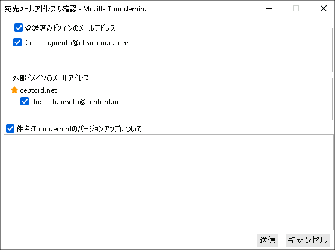

# Thunderbirdとは

メーラーとしての基本的な機能に加えて、企業での運用に合わせたカスタマイズもできる、
そんなメールソフトがThunderbirdです。

ThunderbirdはMozilla Foundationが開発したオープンソースソフトウェアです。
2004年のリリースから10年以上に渡って、世界中の企業や法人で利用されています。

# Thunderbirdの3つの特徴

## 特長1: 基本的な機能が揃っている

IMAP/POP3サポートや、カレンダー・アドレス帳といった基本的な機能に加えて、
高速なメッセージ検索機能や柔軟なメールの振り分けなどの高度な機能も完備しています。

また、フィッシング防止機能や外部画像の読み込みを防止する機能もデフォルトで完備しているので、
セキュリティ面でも安心して運用することができます。

## 特長2: (TBD)

(TBD)

## 特長3: (TBD)

(TBD)

# 企業向けにこんなカスタマイズができます

## 誤送信を防止する「Flex Confirm Mail」

企業でのメール関連のトラブルのナンバーワンが「メールの誤送信」です。
Flex Confirm Mailはそんなトラブルを解決するために開発されたThunderbird用のアドオンです。

メール送信時にメールアドレス・件名・添付ファイルを念入りに確認する機能を備えており、
様々な企業様でのメール誤送信防止の声が詰め込まれた、企業導入に最適なアドオンです。

{width=400}

## Redmineとの連携を強化する「RedThunderMineBird Plus」

企業間のやりとりにおいてメールが使われる場面は多いですが、個々のトピックの進行状況や関連情報までの把握には、別途Redmineなどのプロジェクト管理ツールを併用することが多いです。
RedThunderMineBird Plusは、Thunderbirdで受信したメールとRedmine上のチケットを関連付けて取り扱えるようにするアドオンです。

受信したメールからRedmineのチケットを起票したり、その後の返信をチケットへのコメントとして転記したりする機能を備えており、メールのやり取りが多く発生するプロジェクトでの情報共有コストを削減することができます。

# クリアコードについて

クリアコードは、2006年7月にフリーソフトウェア開発者を中心に設立したソフトウェア開発会社です。

私たちはこれまで15年以上にわたってThunderbirdの導入支援を行ってきました。
初期導入時の基本的なサポートや、障害発生時のトラブル対応、
またお客様の事情に合わせたThunderbirdのカスタマイズなども受け付けています。

サービスに関するお問い合わせは [https://www.clear-code.com/contact](https://www.clear-code.com/contact) からご連絡ください。
